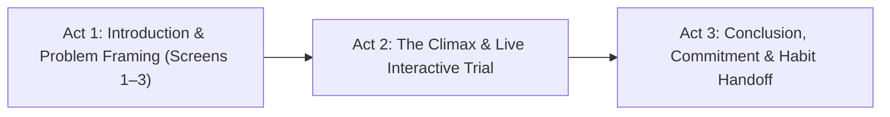
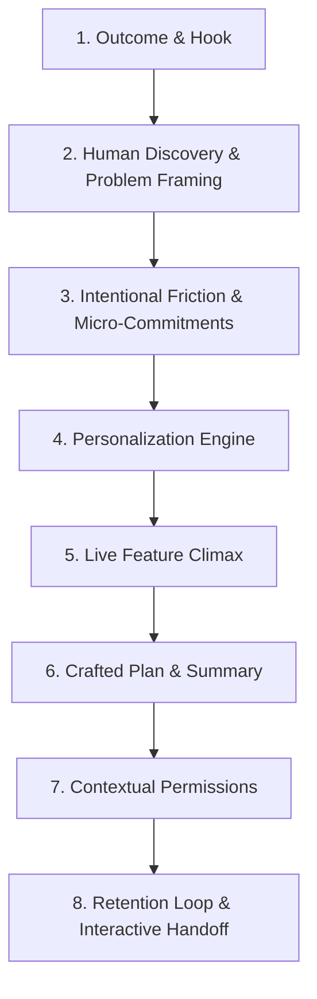

# Onboarding Flow Design & Optimization Skill

A comprehensive, battle-tested framework for architecting, evaluating, and refining onboarding experiences across web and mobile applications. Derived from empirical analysis of **1,460+ onboarding flows** across top-tier products and real-world high-converting consumer app onboarding case studies.

---

## 🎯 The Core Philosophy: The Onboarding Equation

> **Effective onboarding is never about making a flow blindly "short" — it is about maximizing perceived value and emotional investment while minimizing unnecessary friction to accelerate the user's "Aha!" moment.**

```
               ( Perceived Value + Clarity of Outcome + User Investment )
Success Rate = ──────────────────────────────────────────────────────────
                     ( Unnecessary Friction + Premature Demands )
```

### The Core Truths:
1. **Value Before Friction**: Demonstrate or deliver core value before demanding high commitment (sign-ups, permissions, payments).
2. **Intentional Friction > Blind Speed**: Thoughtful micro-commitments (signing a pledge, answering reflective questions, selecting preferences) build psychological investment (the IKEA effect) and dramatically increase retention/conversion compared to frictionless generic flows.
3. **One Decision Per Screen**: Break complex setup into discrete, digestible micro-interactions rather than dense multi-field forms.
4. **Contextual Asking**: Request permissions or credentials only at the precise moment their utility is obvious to the user.
5. **Active Doing > Passive Reading**: Replace static, skippable slide carousels with contextual, interactive engagement and live feature trials.

---

## 🎬 The 3-Act Storyboarding Structure (High-Converting Narrative Flow)

Top consumer apps structure onboarding like a narrative arc rather than a software setup wizard:



### Act 1: Introduction & Problem Framing (Screens 1–3)
- **Identify the Core Pain**: Validate the user's frustration or desire immediately (e.g. *"Tired of clunky emulators that require endless BIOS setup?"*).
- **Personalized Stats / Discovery**: Ask questions that make the user feel heard (e.g. favorite era, gaming habits, device setup).
- **Fast "Aha!" Frame**: Deliver clarity on the solution in under 60 seconds without cognitive overload.

### Act 2: The Climax (Live Feature Interaction)
- **The Core Interactive Moment**: Instead of *describing* what the app does, let the user experience the core mechanic *inside* the onboarding.
- **Micro-Win & Gamification**: Trigger an instant reward (e.g., test-playing a 3-second sound byte/gameplay loop, seeing live shader rendering, or celebrating with a streak animation).
- **Social Proof / Sentiment Peak**: When users experience this climax and dopamine hit, sentiment is at peak — prime moment for soft feedback or rating prompts.

### Act 3: Conclusion & The Commitment Bridge
- **Synthesized Journey Recap**: Visually present everything configured based on their choices.
- **Psychological Micro-Commitments**: Have the user commit to their goal (e.g. pledge, habit expectation, signature, or custom shortcut creation).
- **Clear Habit / Value Anchoring**: Explicitly set expectations for continuous engagement (e.g. *"Your retro arcade is ready whenever you need a 5-minute break"*).

---

## 🏗️ The 8-Pillar Onboarding Framework



---

### Pillar 1: Outcome-Driven Hook (Show the Transformation)
*Don't sell features; showcase the user's future state.*

- **Visual Outcome Previews**: Display live UI previews, custom dashboards, or dynamic assets matching the user's aspirations rather than generic feature bullet points.
- **Micro-Copy Framing**: Frame steps around user benefits (e.g., *"Set up your retro battle station in 30 seconds"*, not *"Configure system settings"*).
- **Instant Demo / Playground**: If possible, allow users to interact with a sandbox or sample data immediately upon landing before any setup is required.

---

### Pillar 2: Human & Conversational Interface
*Make the user feel heard and understood through empathetic UI.*

- **Conversational Tone**: Use conversational micro-copy that validates the user’s intent and skill level.
- **Encouragement & Validation**: Acknowledge choices with positive micro-feedback (e.g., *"Great choice! GBA games look stunning in CRT shader mode"*).
- **Relatable Personas**: Offer clear persona pathways (e.g., *"Casual Nostalgia Fan"*, *"Hardcore Speedrunner"*, *"First-Time Emulation Player"*).

---

### Pillar 3: Intentional Friction & Micro-Commitments
*Friction isn't always bad — purposeful effort builds perceived value and ownership.*

- **The IKEA Effect**: When users invest a small amount of effort to customize or shape their environment, they value the end product significantly more.
- **Micro-Agreements & Pledges**: Asking for simple commitments (e.g., tapping *"I'm ready"*, selecting target daily/weekly goals, or signing a digital pledge) anchors user intent.
- **Progressive Investment**: Start with zero-friction single-tap choices and build up to deeper customizations.

---

### Pillar 4: Personalization & Progressive Profiling
*Collect intent data to dynamically reshape the application.*

- **Multi-Intent Queries**: Ask 2–4 high-impact questions to configure defaults:
  1. *Primary Goal / Interest* (e.g., favorite genres, platforms, playstyle).
  2. *Experience / Skill Level* (e.g., Novice vs. Veteran).
  3. *Preferred Controls / Environment* (e.g., Gamepad, Keyboard, Touch).
- **Smart Presets**: Auto-select sensible defaults based on device detection (touchscreen vs. physical gamepad vs. desktop keyboard).
- **Skippable by Design**: Always provide an easy, low-friction escape hatch (*"Skip to library"* or `Esc` key) for returning power users.

---

### Pillar 5: The Climax / Live Interactive Test
*Let the user test-drive the magic before finishing the flow.*

- **Interactive Sandbox / Button Check**: Let the user press a gamepad button or press a key and see responsive real-time visual feedback.
- **Immediate Sensory Payoff**: Audio chime, tactile visual pulse, or shader toggle preview that confirms the system is alive and tailored for them.

---

### Pillar 6: The Personalized Outcome (The "Crafted Plan")
*Reward the user's input with an immediate, custom summary.*

- **Dynamic Plan / Summary Screen**: Synthesize user answers into a tailored summary before dropping them into the app (e.g., *"We've configured 4 NES classics, enabled 1080p CRT filter, and mapped your Bluetooth controller"*).
- **Perceived Effort Animation**: Use a 1.2–2.0 second loading state (*"Assembling your curated collection..."*) with animated checkmarks. Users value results more when they perceive thoughtful processing.

---

### Pillar 7: Contextual Permissions & Pre-Permission Modals
*Never trigger native browser/OS permission prompts out of nowhere.*

- **Soft Prompts (In-App Pre-Dialogs)**: Always display a branded in-app modal explaining *why* the permission is needed and *what benefit* it unlocks before calling `navigator.permissions` or native APIs.
- **Just-In-Time Timing**:
  - ❌ *Anti-pattern*: Asking for Audio, Fullscreen, Gamepad, or Notification permissions on slide 1.
  - ✅ *Best-practice*: Prompting for Gamepad pairing when the user selects a game; prompting for Audio on first user interaction.
- **Graceful Fallbacks**: If permission is denied or dismissed, provide a clear fallback state without breaking the user flow.

---

### Pillar 8: Making Long Flows Feel Short (Psychological Velocity)
*Optimize cognitive flow and perceived speed.*

| Strategy | Implementation Technique | Psychological Mechanism |
| :--- | :--- | :--- |
| **Micro-Stepping** | 1 core question per card with instant auto-advance upon selection. | Eliminates cognitive overload & form fatigue. |
| **Progress Visibility** | Segmented progress bars with percentage or step indicators (`Step 2 of 4`). | Goal-gradient effect (momentum builds towards the finish). |
| **Zeigarnik Momentum** | Start progress bar at 15–20% on the very first screen. | Endowed progress effect (users feel they have already started). |
| **Micro-Celebrations** | Subtle haptic pulse, sound effect chime, or brief particle burst upon completion. | Dopamine reinforcement loop. |

---

## 📊 Onboarding Audit Checklist (Use for Reviewing Any Flow)

Use this checklist when auditing or building an onboarding flow:

### 1. First Impression & Narrative Arc (Act 1)
- [ ] Does the first screen clearly frame the problem and communicate the core benefit / transformation?
- [ ] Does it deliver an "Aha!" realization within the first 60 seconds?
- [ ] Can a user skip the entire flow in 1 click / keypress if they want to jump straight in?

### 2. Interaction & Climax (Act 2)
- [ ] Is there an interactive trial or live element rather than just passive reading?
- [ ] Are choices acknowledged with positive micro-feedback or instant visual previews?
- [ ] Are micro-commitments used to build user investment (IKEA effect)?

### 3. Personalization & Summary (Act 3)
- [ ] Do user choices actively alter subsequent UI, defaults, or recommendations?
- [ ] Is there a synthesized "personalized summary" confirming user choices with perceived effort animation?
- [ ] Are clear habit expectations or immediate next steps communicated?

### 4. Permissions & Native Prompts
- [ ] Are all native permissions preceded by an in-app soft explanation?
- [ ] Are permissions requested strictly in context when triggered by user intent?

### 5. Accessibility & Spatial Navigation
- [ ] Is the entire onboarding flow 100% operable via Keyboard (`Tab`, `Enter`, `Arrow keys`, `Esc`)?
- [ ] Is the entire flow navigable via Gamepad / Controller (D-Pad, `A`, `B`, `Start`)?
- [ ] Is the layout 100% responsive across Mobile, Tablet, Desktop, and 4K displays with zero modal overflow?

---

## 🕹️ RetroPlayer Specific Application Guidelines

When applying this skill to **RetroPlayer** (`src/components/OnboardingScreen.jsx`, `TutorialModal.jsx`, etc.):

1. **Act 1 - Experience Preset & Problem Framing**: Ask user playstyle (*"Quick Casual Gamer"*, *"Retro Enthusiast"*, *"Pure Performance"*). Auto-configure CRT filter, audio volume, and overlay.
2. **Act 2 - Interactive Climax & Controller Check**: Live interactive button response / visual gamepad check so users immediately test their inputs in real-time.
3. **Act 3 - Curated Quick-Start**: Offer instant 1-click curated starter favorites (e.g., 2048, Anguna, Micro Mages) to drop them into gameplay within 5 seconds.
4. **Dynamic Recap**: Show a retro "Save Card / Memory Card" styled recap with animated status badges reflecting their exact setup.
5. **Gamepad & Spatial Nav**: Ensure every card, button, and skip link has focus rings and reacts to standard controller buttons (`A` = Select, `B` = Back, `Start` = Finish).
