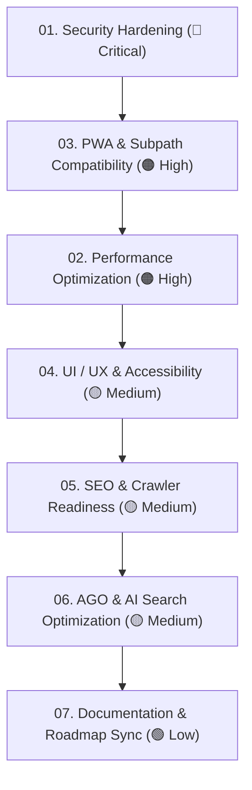

# 🛡️ Audit Hub — {{DATE}} (Full-System Master Audit)

> Comprehensive architectural, security, performance, UI/UX, accessibility, SEO, AI search optimization (AGO), and PWA audit conducted on **{{DATE}}**.
>
> Use this hub and its decoupled action specifications to review, prioritize, and execute remediation step-by-step.

---

## 📊 Master Scorecard & Severity Matrix

| Area | Grade | Severity | Primary Concerns | Specification Document | Status |
| :--- | :---: | :---: | :--- | :--- | :---: |
| **1. Security** | **{{SECURITY_GRADE}}** | 🚨 Critical | Path traversal, SSRF, CORS, HTTP headers, container privileges | **[01-security-hardening.md](01-security-hardening.md)** | 📋 Pending |
| **2. Performance** | **{{PERF_GRADE}}** | 🟠 High | Font waterfalls, bundle splitting, React.lazy, rAF polling | **[02-performance-optimization.md](02-performance-optimization.md)** | 📋 Pending |
| **3. PWA & Subpath** | **{{PWA_GRADE}}** | 🟠 High | Service worker subpaths, offline fallbacks, asset caching | **[03-pwa-subpath-compatibility.md](03-pwa-subpath-compatibility.md)** | 📋 Pending |
| **4. UI / UX & a11y** | **{{UI_GRADE}}** | 🟡 Medium | Keyboard & gamepad spatial navigation, viewport adaptive density | **[04-ui-ux-accessibility.md](04-ui-ux-accessibility.md)** | 📋 Pending |
| **5. SEO & Crawlers** | **{{SEO_GRADE}}** | 🟡 Medium | Canonical links, Schema.org JSON-LD, SPA noscript fallbacks | **[05-seo-and-crawler-readiness.md](05-seo-and-crawler-readiness.md)** | 📋 Pending |
| **6. AGO / AI Search** | **{{AGO_GRADE}}** | 🟡 Medium | llms-full.txt, AI discovery tags, W3C manifest store parity | **[06-ago-and-ai-search-optimization.md](06-ago-and-ai-search-optimization.md)** | 📋 Pending |
| **7. Docs & Roadmap** | **{{DOCS_GRADE}}** | 🟢 Low | Broken links, licensing, guides and mirai roadmap sync | **[07-documentation-and-roadmap-sync.md](07-documentation-and-roadmap-sync.md)** | 📋 Pending |

---

## 🗓️ Recommended Execution Order

---

## ✅ Master Interactive Checklist

- [ ] Complete **01-security-hardening.md**
- [ ] Complete **02-performance-optimization.md**
- [ ] Complete **03-pwa-subpath-compatibility.md**
- [ ] Complete **04-ui-ux-accessibility.md**
- [ ] Complete **05-seo-and-crawler-readiness.md**
- [ ] Complete **06-ago-and-ai-search-optimization.md**
- [ ] Complete **07-documentation-and-roadmap-sync.md**
