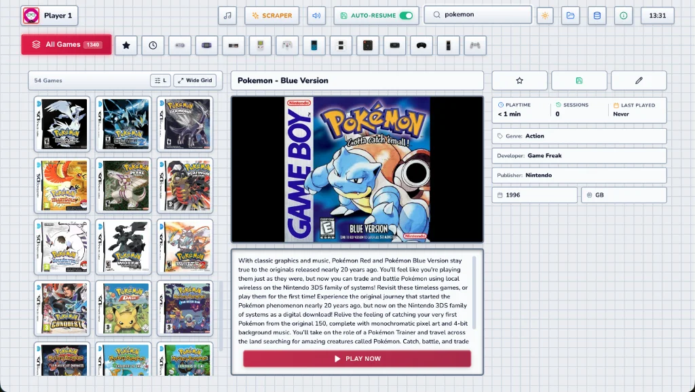

<div align="center">

# 🕹️ RETRO PLAYER

### *The High-Performance, Zero-Overhead Web Emulation Station*

[](https://github.com/godarayudhvir/retro-player/actions)
[](https://github.com/godarayudhvir/retro-player/pkgs/container/retro-player)
[](LICENSE)
[](https://react.dev/)
[](https://vitejs.dev/)
[](https://webassembly.org/)

<br />

**A console-grade retro game launcher and library, delivered straight to any web browser.**  
Featuring physical 3D cartridge rendering, real-time online metadata scraping, synthesized acoustic SFX, and **pure client-side WebAssembly execution**.

<br />



<br /><br />

### 1-Click Instant Deployments

[](https://render.com/deploy?repo=https://github.com/godarayudhvir/retro-player)
&nbsp;&nbsp;
[](https://railway.com/new)

</div>

---

## ⚡ Why Retro Player? The WASM Advantage

Unlike cloud gaming services that stream heavy 25Mbps video feeds and melt your server CPU, **Retro Player uses a modern Edge-WASM architecture**:

```
                               ┌──────────────────────────────────────────────────────────┐
                               │                     YOUR BROWSER                         │
                               │                                                          │
┌────────────────┐  ROM File   │  ┌────────────────────┐   ┌───────────────────────────┐  │
│  Host Server   │ ──────────> │  │ WebAssembly Core   │──>│  60 FPS Canvas Rendering  │  │
│ (Railway/NAS)  │  (Few MB)   │  │ (Runs on client)   │   │  0ms Gamepad Polling      │  │
│ ~0% CPU / RAM  │             │  └────────────────────┘   │  Web Audio SFX Synthesizer│  │
└────────────────┘             │                           └───────────────────────────┘  │
                               └──────────────────────────────────────────────────────────┘
```

- **🔥 Server Resource Usage is ~0%**: The host only serves static files and streams the raw ROM binary once. Even a free-tier container or Raspberry Pi can serve hundreds of concurrent players.
- **⚡ 0ms Input Lag**: Controllers and keyboards are polled directly in the client browser with zero network latency.
- **💾 Automatic Auto-Sorting Disk Persistence**: Load any ROM from your browser—it is automatically sorted and saved to your host disk (`/roms/<system>/`) for future sessions.
- **🛡️ 100% Air-Gapped Offline Support**: Features dual-mode fallback to local core bundles when offline.

---

## ✨ Key Highlights

- 🎨 **4 Signature Themes**: **iiSU Light**, **Midnight Cyber**, **Sony XMB Wave**, and **Game Boy DMG**.
- 💾 **3D Physical Cartridge Engine**: Tactile cartridges with metallic sheens, grip textures, and title color heuristics.
- 🌐 **Automated ES-DE Online Metadata Scraper**: Official 3D box art from **Libretro** & synopsis info from **Wikipedia**, cached in **IndexedDB**.
- 🔊 **Synthesized Pure Web Audio UI SFX**: Zero-latency acoustic feedback synthesizer with zero external audio assets.
- 🎮 **Full Gamepad & Keyboard Navigation**: D-Pad/Stick navigation, shoulder triggers (`L1`/`R1`), on-screen virtual keyboard (`⌘K`), and quick-launch.
- ⏱️ **Playtime Analytics & Smart Collections**: Session durations, total hours played, **Favorites ⭐**, and **Recently Played** queue.

---

## 🕹️ Supported Systems

| System | Platform Key | Default Core | Supported File Extensions |
| :--- | :--- | :--- | :--- |
| **Game Boy Advance** | `gba` | `gba` (mGBA) | `.gba` |
| **Game Boy / Color** | `gb`, `gbc` | `gb` (Gambatte) | `.gb`, `.gbc` |
| **Super Nintendo** | `snes` | `snes` (Snes9x) | `.sfc`, `.smc`, `.snes` |
| **Nintendo (NES)** | `nes` | `nes` (FCEUmm) | `.nes` |
| **Nintendo 64** | `n64` | `n64` (Mupen64Plus) | `.z64`, `.n64`, `.v64` |
| **Nintendo DS** | `nds` | `nds` (MelonDS / DeSmuME) | `.nds` |
| **Sega Genesis / Mega Drive** | `genesis` | `segaMD` (Genesis Plus GX) | `.gen`, `.md`, `.smd` |
| **PlayStation (PS1)** | `ps1` | `psx` (Beetle PSX) | `.chd`, `.iso`, `.cue`, `.bin` |
| **Arcade** | `arcade` | `mame2003_plus` | `.zip` |

---

## 🚀 Quick Start: Docker Compose

Deploy Retro Player in seconds with [`docker-compose.yml`](docker-compose.yml):

```bash
mkdir retro-player && cd retro-player
curl -O https://raw.githubusercontent.com/godarayudhvir/retro-player/main/docker-compose.yml
docker compose up -d
```

Open `http://localhost:3000` in your browser!

---

## 📖 Guides & Documentation

Explore dedicated, step-by-step guides located in the [`guides/`](guides/README.md) directory:

| Guide | Description |
| :--- | :--- |
| **[🐳 Docker Deployment Guide](guides/docker.md)** | Full Docker & Docker Compose setup, CLI commands, updates, and troubleshooting. |
| **[☁️ Cloud & Self-Hosting Guide](guides/hosting.md)** | Detailed setup for Railway, Render, Fly.io, Coolify, Portainer, and NAS (Unraid/TrueNAS). |
| **[🌐 Remote Access & Anywhere Play](guides/remote-access.md)** | Access your home instance from phones/tablets via **Tailscale Mesh VPN** or **Cloudflare Tunnels**. |

---

## 🎮 Controls Quick Reference

### Dashboard Navigation
| Action | Keyboard | Gamepad |
| :--- | :--- | :--- |
| **Navigate Grid & Menus** | Arrow Keys / `W`, `A`, `S`, `D` | D-Pad / Left Stick |
| **Switch System / Tab** | `Q` / `E` / `PageUp` / `PageDown` | `L1` / `R1` (Shoulder Buttons) |
| **Select / Launch Game** | `Enter` / `Space` | `A` Button (Button 0) |
| **Toggle Favorite ⭐** | `F` Key | `X` Button (Button 2) |
| **Switch Theme 🎨** | `T` Key | Topbar Theme Button |
| **Search / Virtual Keyboard** | `⌘K` / `Ctrl+K` | `Y` Button (Button 3) / `Select` |
| **Back / Close Modals** | `Escape` / `Backspace` | `B` Button (Button 1) |

### In-Game Emulation
| Action | Keyboard | Gamepad |
| :--- | :--- | :--- |
| **Directional Movement** | Arrow Keys / `W`, `A`, `S`, `D` | D-Pad / Left Stick |
| **Primary Actions (A / B)** | `Z` / `X` | `A` / `B` Buttons |
| **Start / Select** | `Enter` / `Shift` | `Start` / `Select` |
| **Exit Game to Launcher** | `Escape` | `Select` + `Start` (or Guide Button) |

---

## 📚 Technical Architecture Specifications

Retro Player follows rigorous software engineering standards with full technical design specifications under [`architecture/`](architecture/README.md):

- **[Core Entry & Bootstrap](architecture/core/index.md)**: Entry point, React mounting, Express production server & Docker containerization.
- **[Application Shell Orchestrator](architecture/core/app.md)**: Hook lifecycle, state coordination, and modal management.
- **[Emulator Engine](architecture/modules/emulator.md)**: EmulatorJS iframe isolation, core fallback & battery SRAM detection.
- **[Metadata Scraper](architecture/modules/metadata-scraper.md)**: Libretro & Wikipedia dynamic scraper with IndexedDB caching.
- **[Synthesized Audio SFX](architecture/modules/audio-sfx.md)**: Pure Web Audio API acoustic synthesis.
- **[Theme Engine](architecture/modules/theme-engine.md)**: Real-time CSS tokens and instant theme persistence.
- **[Game Catalog Indexer](architecture/modules/game-catalog.md)**: Zero-config auto-scanning and persistent upload pipeline.
- **[Mirai Master Vision](mirai.md)**: Deliverables checklist and multi-domain innovation roadmap.

---

## 📄 License

Distributed under the **MIT License**. See `LICENSE` for more information.

<div align="center">
Made with ❤️ for classic gaming enthusiasts worldwide.
</div>
