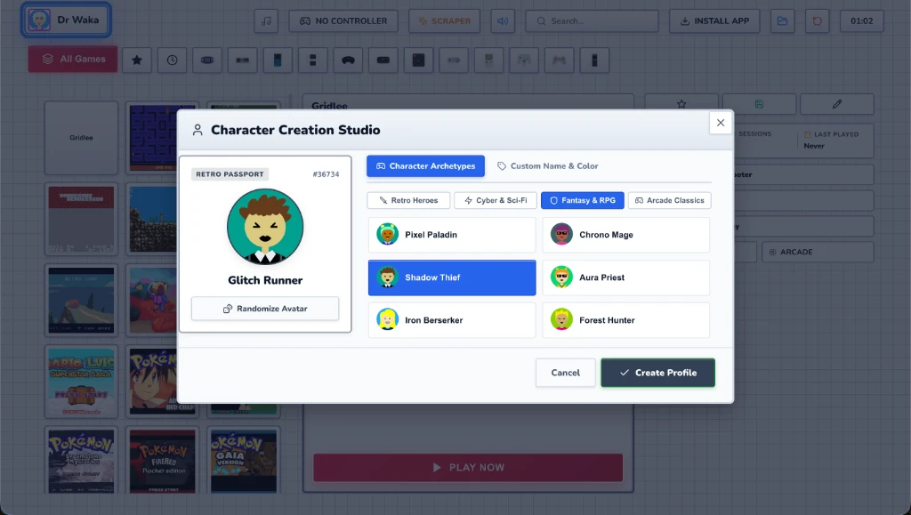
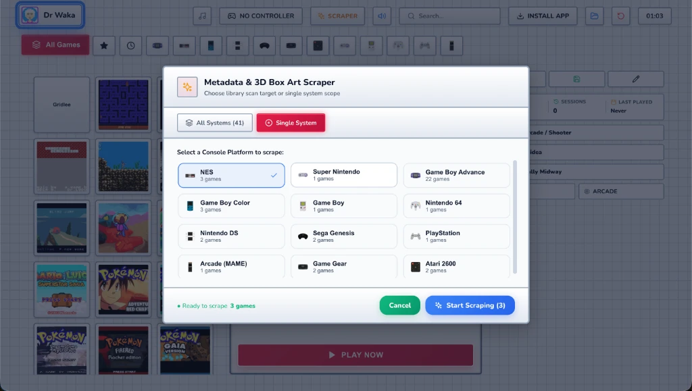

<div align="center">


# RETRO PLAYER

### *The High-Performance, Zero-Overhead Web Emulation Station*

[](https://godarayudhvir.github.io/retro-player/)

<br />

[](https://github.com/godarayudhvir/retro-player/actions/workflows/deploy-pages.yml)
[](https://github.com/godarayudhvir/retro-player/actions)
[](https://github.com/godarayudhvir/retro-player/pkgs/container/retro-player)
[](https://www.pwabuilder.com/)
[](LICENSE)
[](https://react.dev/)
[](https://vitejs.dev/)
[](https://webassembly.org/)

<br />

**A console-grade retro game launcher and library, delivered straight to any web browser.**  
Featuring Nintendo DS dual-screen Touch architecture, integrated zero-popup Strategy Guides & inline Metadata Editor/Scraper, Multiavatar Character Creation Studio with Archetype presets, real-time online metadata scraping, synthesized acoustic SFX, and **pure client-side WebAssembly execution**.

<br />

🎮 **[▶ PLAY LIVE DEMO IN BROWSER (NO INSTALL REQUIRED)](https://godarayudhvir.github.io/retro-player/)**

<br />


</div>

---

## 📸 Screenshots

<div align="center">

| Profile Selector | Character Creation Studio |
|---|---|
|  |  |

| Metadata & 3D Box Art Scraper | Load Custom ROM |
|---|---|
|  |  |

</div>

## ⚡ Why Retro Player? The WASM Advantage

Unlike cloud gaming services that stream heavy 25Mbps video feeds and melt your server CPU, **Retro Player uses a modern Edge-WASM architecture**:

```
                               ┌──────────────────────────────────────────────────────────┐
                               │                     YOUR BROWSER                         │
                               │                                                          │
┌────────────────┐  ROM File   │  ┌────────────────────┐   ┌───────────────────────────┐  │
│  Host Server   │ ──────────> │  │ WebAssembly Core   │──>│ Hardware Canvas Rendering │  │
│ (Railway/NAS)  │  (Few MB)   │  │ (Runs on client)   │   │  Direct Gamepad Polling   │  │
│ ~0% CPU / RAM  │             │  └────────────────────┘   │  Web Audio Synthesizer    │  │
└────────────────┘             │                           └───────────────────────────┘  │
                               └──────────────────────────────────────────────────────────┘
```

- **🔥 Server Resource Usage is ~0%**: The host only serves static files and streams the raw ROM binary once. Even a free-tier container or Raspberry Pi can serve hundreds of concurrent players.
- **⚡ Low-Latency Local Input**: Controllers and keyboards are polled directly in the client browser with zero network streaming delay.
- **💾 Automatic Auto-Sorting Disk Persistence**: Load any ROM from your browser—it is automatically sorted and saved to your host disk (`/roms/<system>/`) for future sessions.
- **🛡️ Air-Gapped Offline Support**: Features dual-mode fallback to local core bundles when offline.

---

## Key Highlights & Features

- 🎮 **Console Gamepad & Spatial Navigation**: 100% controller-driven library navigation with an adaptive on-screen virtual keyboard.
- ⚡ **Pure Client-Side WASM Emulation**: Hardware-accelerated WebAssembly execution across 12 retro platforms with ~0% host CPU usage.
- 🎨 **Nintendo DS Touch Architecture**: Dual-screen layout featuring top-screen dynamic box art & specs, bottom touchscreen carousel, and inline tools.
- 💾 **Profile-Scoped Battery Saves**: In-game battery RAM (`.sav`/SRAM) and quick save states strictly isolated per Multiavatar player profile.
- 🌐 **Automated Metadata & Box Art Scraper**: Instant 3D covers from Libretro CDN, Wikipedia synopses, real-time scan telemetry, and manual editor.
- 📖 **Curated Strategy Guides & QR Companion**: Direct written/video walkthroughs with mobile QR code pairing for couch play.
- 🎵 **Dynamic BGM & Synthesized SFX**: Multi-track chiptune engine with smart in-game pause and low-latency Web Audio sound effects.
- 📱 **Adaptive Cross-Device PWA**: Standalone installable app optimized across Mobile Touch Feeds, Steam Deck, Desktop, and 10-Foot TV mode.
- 💡 **In-Game Rotating Tips**: Glassmorphic loading tips positioned directly below the loading dialog, revolving smoothly every 2 seconds with guaranteed minimum visibility.
- 📹 **60 FPS Recorder & Engine Controls**: In-browser video capture, speed turbo throttling (`1.0x`–`5.0x`), VSync, and live diagnostic HUD.

---

## 🕹️ Supported Consoles & Platforms

Retro Player supports **12 classic retro gaming platforms** out of the box:

| Category | Supported Consoles | Formats | Default Emulation Core |
| :--- | :--- | :--- | :--- |
| **Handhelds** | Game Boy Advance (`gba`), Game Boy Color (`gbc`), Game Boy DMG (`gb`), Sega Game Gear (`game_gear`), Nintendo DS (`nds`) | `.gba`, `.gbc`, `.gb`, `.gg`, `.nds` | mGBA, Gambatte, Genesis Plus GX, MelonDS |
| **Home Consoles** | Super Nintendo (`snes`), NES (`nes`), Nintendo 64 (`n64`), Sega Genesis (`sega_genesis`), Atari 2600 (`atari_2600`), PlayStation 1 (`playstation`) | `.sfc`, `.smc`, `.nes`, `.z64`, `.md`, `.gen`, `.a26`, `.chd`, `.iso`, `.cue` | Snes9x, FCEUmm, Mupen64Plus, Genesis Plus GX, Stella, Beetle PSX |
| **Arcade** | Arcade MAME (`arcade`) | `.zip` | MAME 2003 Plus |

---

## 🎮 Bundled Demo Showcase & Compliance

Retro Player includes a lightweight collection of **41 non-commercial demonstration ROMs and homebrew titles** across 12 console platforms to immediately verify core performance in your browser:

- 📑 **Full Demo Catalog & Inventory**: See **[guides/roms.md](guides/roms.md)** for the complete file-by-file inventory, system file sizes, and homebrew developer credits.
- 🎯 **Strictly Non-Complete Software**: All pre-installed software consists of non-commercial prototypes, trade show trials, and aftermarket homebrew demos. **Zero full retail commercial games are bundled.**
- ⚖️ **Compliance & Immediate Removal Policy**: If you are a rights holder or creator and would like any sample removed, open an issue/PR and **we will immediately comply**.
- 🔒 **100% Private Custom ROM Loading**: To play personal game dumps, use **"Load Custom ROM"** or drag-and-drop—files run 100% in local browser memory with zero network uploads.

---

## 🚀 Quick Start: Docker Compose

Deploy Retro Player in seconds with [`docker-compose.yml`](docker-compose.yml):

```bash
mkdir retro-player && cd retro-player
curl -O https://raw.githubusercontent.com/godarayudhvir/retro-player/main/docker-compose.yml
docker compose up -d
```

Open `http://localhost:3000` in your browser!

> [!TIP]
> **Docker Customization**: You can customize volumes (`./roms`, `./bgm`, `./data`) and environment flags (`INCLUDE_DEMO_ROMS`, `INCLUDE_DEMO_BGM`, `AUTO_SEED_DEMOS`) directly in [`docker-compose.yml`](docker-compose.yml). See the **[Docker Deployment Guide](guides/docker.md)** for full details.

---

## 📖 Modular Guides & Documentation

Explore dedicated, step-by-step documentation located in the [`guides/`](guides/README.md) directory:

| Guide | Description |
| :--- | :--- |
| **[🐳 Docker Deployment Guide](guides/docker.md)** | Full Docker & Docker Compose setup, CLI commands, updates, and troubleshooting. |
| **[☁️ Cloud & Self-Hosting Guide](guides/hosting.md)** | Detailed setup for Railway, Render, Fly.io, Coolify, Portainer, and NAS (Unraid/TrueNAS). |
| **[🌐 Remote Access & Anywhere Play](guides/remote-access.md)** | Access your home instance from phones/tablets via **Tailscale Mesh VPN** or **Cloudflare Tunnels**. |
| **[🎮 Controls & Keybindings Guide](guides/controls.md)** | Full gamepad button mappings, dashboard spatial navigation, virtual keyboard, and in-game controls. |
| **[💾 Save States & In-Game Save Architecture](guides/save-states.md)** | Snapshot quick saves vs in-game battery saves (`.sav`) breakdown across all 12 console platforms. |
| **[🌐 Hardware & Platform Compatibility Matrix](guides/compatibility.md)** | Browser, OS, Smart TV (LG webOS, Samsung Tizen, Fire TV), Handheld (Steam Deck), and Console compatibility breakdown. |
| **[📱 Cross-Device Experience Matrix](guides/device-experience-matrix.md)** | Feature sets, UI density, input modes, and admin capabilities compared across Mobile, Handheld, PC, and TV. |
| **[🎮 Bundled ROMs Catalog & Compliance Policy](guides/roms.md)** | Curated demo inventory, legal compliance, and local companion sidecars (`.nfo`, `.json`, `cover.webp`) guide. |

---

## 🛠️ Workspace Skills & Automation Tooling

Retro Player includes built-in AI agent skills and automated utility scripts under [`.agents/skills/`](.agents/skills/):

| Skill | Path | Description |
| :--- | :--- | :--- |
| **[Codebase Stats](.agents/skills/codebase-stats/SKILL.md)** | [`.agents/skills/codebase-stats/`](.agents/skills/codebase-stats/) | Analyzes and reports file extension counts, sizes, and summaries while filtering build/cache folders. |
| **[Update ROMs](.agents/skills/update-roms/SKILL.md)** | [`.agents/skills/update-roms/`](.agents/skills/update-roms/) | Organizes ROM folders, handles version upgrades & custom screenshot replacements, converts covers to WebP, and generates/syncs `metadata.json` sidecars. |
| **[ROM Cleanup](.agents/skills/rom-cleanup/SKILL.md)** | [`.agents/skills/rom-cleanup/`](.agents/skills/rom-cleanup/) | Deduplicates dated builds, prunes non-English regions, and filters obscure releases with structured keep/remove approval. |

---

## 🔮 Future Roadmap (Mirai)

Upcoming feature designs, technical blueprints, and step-by-step implementation guides are organized under [`mirai/`](mirai/README.md):

- **[Master Roadmap Index](mirai/README.md)**: Prioritized status index across all upcoming milestones.
- **[3D Cartridge & Media Designs](mirai/cartridge-designs-spec.md)**: Master geometric specifications for authentic physical cartridge shells.
- **[Local Directory Library Mount](mirai/local-directory-library.md)**: Direct filesystem folder mounting and client-side metadata scraping.
- **[BYOS Cloud Storage](mirai/byos-cloud-storage.md)**: Bring-Your-Own-Storage streaming (Google Drive, AWS S3, Cloudflare R2).
- **[Cross-Device Cloud Saves](mirai/cloud-saves.md)**: Cloud synchronization for quick saves and battery SRAM states.
- **[Self-Hosted User Management](mirai/self-hosted-user-management.md)**: Multi-user auth, admin dashboard, and role permissions.
- **[Organic Achievements & Trophies](mirai/organic-achievements.md)**: Universal gameplay milestones, trophies, and unlock toasts.
- **[Settings Hub Redesign](mirai/settings-hub.md)**: Enhanced console library management and diagnostic tools.
- **[WebRTC Netplay](mirai/multiplayer.md)**: Peer-to-peer online multiplayer with input rollback synchronization.

---

## 📄 License

Distributed under the **MIT License**. See `LICENSE` for more information.

<div align="center">
Made with ❤️ for classic gaming enthusiasts worldwide.
</div>
