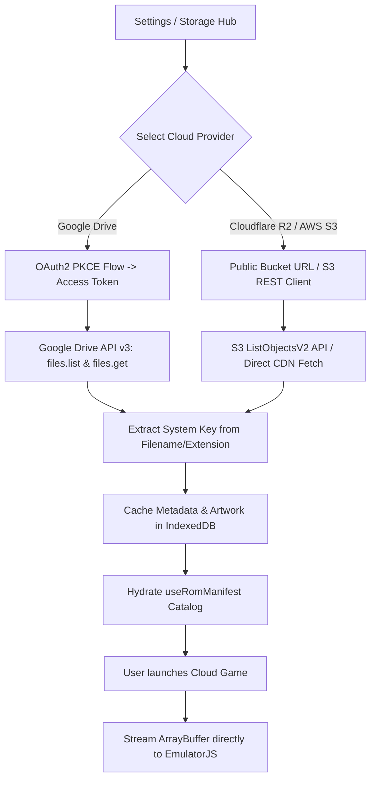

# Bring-Your-Own-Storage (BYOS) Cloud Providers (`architecture/mirai/byos-cloud-storage.md`)

## 1. Description

The **Bring-Your-Own-Storage (BYOS) Cloud Providers** specification defines a decentralized, zero-server-cost cloud architecture for Retro Player.

Instead of bundling gigabytes of copyrighted or large ROM files into the GitHub repository or paying for central server storage, Retro Player allows users to connect their own personal cloud storage providers (**Google Drive**, **Cloudflare R2**, and **AWS S3**). All API keys, OAuth tokens, bucket URLs, and permissions remain strictly in the user's local browser (`localStorage` / `IndexedDB`), providing complete privacy and zero backend maintenance or hosting costs for the project.

---

## 2. Detailed List of What It Will Do

### Provider Integrations
- **Google Drive Integration (OAuth2 PKCE Client-Side)**:
  - Connect via Google Identity Services in browser with zero server proxy.
  - Interactive Google Drive Folder Picker to select a user's personal retro games folder.
  - Automatically queries subfolders, extracts file metadata, and fetches ROM binaries directly into browser memory.
- **AWS S3 & Cloudflare R2 Bucket Integration**:
  - Connect via user-provided public Bucket URL or S3 Read-Only API Credentials (Access Key ID + Secret Access Key + Region + Bucket Name).
  - Automatically fetches the bucket XML/JSON object listing to index ROMs and sidecar covers.
  - Supports HTTP Range Requests (`206 Partial Content`) for streaming large ROMs (PS1 `.chd`, NDS `.nds`, N64 `.z64`) on-demand.
- **Catalog Synchronization & Caching**:
  - Cloud games are parsed and displayed seamlessly in the main console shelves and themes alongside local games.
  - High-resolution box art and game descriptions are cached locally in `IndexedDB` to minimize cloud API requests and bandwidth usage.
- **Security & Privacy Guarantee**:
  - Tokens and credentials are stored strictly in client storage; no secrets are ever sent to any intermediate server.

---

## 3. Detailed Logic Behind It

### Architecture Overview



### Provider Implementation Details

1. **Google Drive Flow (Client-Side Only)**:
   - Uses `@google/identity-services` with OAuth2 PKCE implicit grant or authorization code flow with client secret kept in user's prompt (or public OAuth Client ID restricted to authorized web origins).
   - Scopes: `https://www.googleapis.com/auth/drive.readonly` (strictly read-only access).
   - Download Endpoint: `https://www.googleapis.com/drive/v3/files/${fileId}?alt=media`.

2. **Cloudflare R2 & AWS S3 Flow**:
   - For public buckets (e.g. `https://my-roms.r2.dev/`): Fetches `manifest.json` or parses S3 XML `ListBucketResult`.
   - For authenticated buckets: Uses lightweight `@aws-sdk/client-s3` in browser or signed URL generation to stream objects.
   - Leverages browser `fetch(url, { headers: { Range: 'bytes=0-...' } })` for fast initial header verification and streaming.

3. **Storage Abstraction Interface**:
   ```javascript
   // src/services/cloud/CloudStorageAdapter.js
   export class CloudStorageAdapter {
     async listGames() { throw new Error('Not implemented'); }
     async getRomBlob(gameId) { throw new Error('Not implemented'); }
     async getArtworkBlob(gameId) { throw new Error('Not implemented'); }
   }
   ```

---

## 4. Detailed Guide of How to Set It Up

1. **Create Cloud Adapters Module**:
   - Create `src/services/cloud/GoogleDriveAdapter.js` (OAuth2 token handling & file streaming).
   - Create `src/services/cloud/S3StorageAdapter.js` (S3 / Cloudflare R2 bucket reader).
   - Create unified registry in `src/services/cloud/cloudManager.js`.
2. **Add Cloud Provider Settings UI**:
   - Add "Cloud Storage Providers" section in the Console Settings modal and Topbar.
   - Implement connection cards with status badges (Connected / Disconnected / Syncing).
3. **Integrate with `useRomManifest.js`**:
   - Allow merging remote cloud-backed ROMs into the active library state with a distinct cloud indicator badge.
4. **Offline & Stream Error Handling**:
   - Graceful fallback with clear in-app status notifications when cloud rate limits or network disconnections occur.
