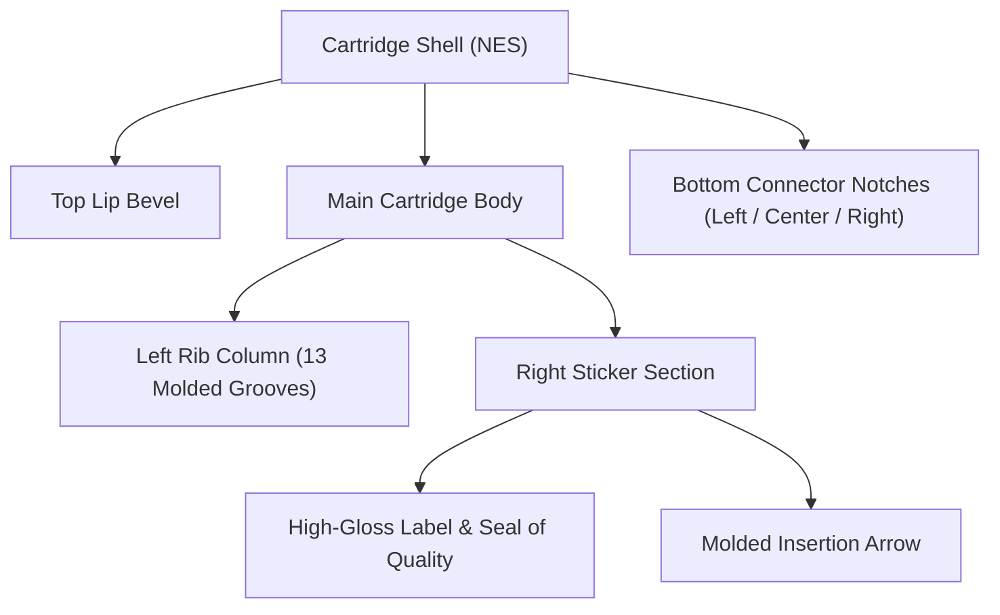

# 🕹️ Mirai Specification: Master 3D Cartridge & Media Design Blueprint

> **Status**: 📋 Future Roadmap Specification  
> **Domain**: Theme Engine / 3D Skeuomorphic Cartridge Presentation  
> **Target**: Modular re-implementation for future themes (e.g. 3D Shelf, Physical Cabinet, Coverflow)

---

## 1. Overview & Architectural Goal

This specification documents the complete structural geometry, CSS tokens, color palettes, and component architecture for the authentic physical retro gaming media formats in **Retro Player**. 

When building future themes (such as a 3D wooden shelf, dynamic arcade cabinet, or holographic showcase), this blueprint provides the exact mathematical proportions, tactile surface highlights, molded ribs, grip pockets, and manufacturer seals needed to render bespoke, authentic cartridges without starting from scratch.

---

## 2. Supported Cartridge & Media Geometries

| Console Format | Primary System Keys | Physical Form Factor & Distinctive Features | Color Palette & Shell Tints |
| :--- | :--- | :--- | :--- |
| **NES / Famicom** | `nes`, `famicom` | Tall vertical light-gray cartridge with 13 molded side grip ribs, stepped corner notches, and bottom connector lip. | Classic Nintendo Light Gray (`#a8a29e`), Gold Zelda variant. |
| **SNES / Super Famicom** | `snes`, `sfc` | Wide chassis with flanking 5-rib wings, screw holes, curved label recess, and bottom eject ramp. | Two-tone Super Nintendo Gray (`#cbd5e1` / `#94a3b8`) with purple accents. |
| **Nintendo 64 (N64)** | `n64` | Arched curved top crest, twin flanking grip wings with dual-tier bevels, wide arched glossy label. | Charcoal Gray (`#334155`), Atomic Purple, Fire Orange, Jungle Green, Pikachu Yellow. |
| **Game Boy Advance (GBA)** | `gba` | Compact horizontal dark gray shell with top molded thumb groove, recessed bevels, and curved label lip. | Dark Indigo / Charcoal (`#3f3f46`), Clear Glaze. |
| **Nintendo DS (NDS)** | `nds`, `ds` | Ultra-compact square matte black/dark-gray card with top pin guide notch, beveled edges, and corner cut. | Dark Slate (`#1e293b`). |
| **Sega Genesis / Mega Drive** | `genesis`, `megadrive` | Tall deep-black cartridge with prominent vertical serrated top grip ribs, red brand stripe, and arched top. | Pitch Black (`#0f172a`), Japanese Mega Drive Gold/Red accents. |
| **Game Boy / Color (GB/GBC)** | `gb`, `gbc` | Iconic top grooved notch with embossed "GAME BOY" imprint, curved bottom lip, and square sticker window. | Original GB Off-White / Gray (`#d1d5db`), Pokémon Yellow, Gold, Silver, Crystal. |
| **Sega Game Gear** | `gamegear`, `gg` | Wide heavy-gauge black cartridge with ribbed side grips and prominent curved top notch. | Textured Sega Charcoal (`#18181b`). |
| **Atari 2600** | `atari2600`, `a2600` | Heavy wedge cartridge with prominent horizontal front grill slats and classic orange/red typography. | Retro Matte Black (`#1c1917`) with vinyl woodgrain accents. |
| **PlayStation (PS1)** | `psx`, `ps1` | Authentic CD Jewel Case with clear acrylic lid, glass sheen glare, left-hinge spine, and center CD spindle teeth. | Crystal Clear Glass Acrylic with black/gray tray. |
| **Arcade / MAME** | `arcade`, `mame`, `neogeo` | Vertical illuminated marquee poster with illuminated glass bevel and metallic system badge. | Vibrant marquee lighting with golden trim. |

---

## 3. Cartridge Geometry & CSS Layer Models

### 3.1 NES Cartridge Architecture

- **CSS Classes**:
  - Container: `.cartridge-shell.cartridge-shell-nes`
  - Grooves: `.nes-rib-groove`, `.nes-mini-groove`
  - Sticker: `.nes-sticker-area`, `.nes-label-img`
  - Inset Arrow: `.nes-molded-arrow`
  - Base: `.nes-bottom-connector-steps`

---

### 3.2 SNES Cartridge Architecture
- **CSS Classes**:
  - Container: `.cartridge-shell.cartridge-shell-snes`
  - Side Wings: `.snes-side-wing.left`, `.snes-side-wing.right` (5 horizontal ribs + screw indent)
  - Center Pocket: `.snes-center-section`
  - Label: `.snes-sticker-area` with `.snes-license-text` and `.snes-red-banner`
  - Grip Pocket: `.snes-lower-grip-pocket` with left/right cuts and center ramp

---

### 3.3 Nintendo 64 (N64) Cartridge Architecture
- **CSS Classes**:
  - Container: `.cartridge-shell.cartridge-shell-n64`
  - Top Arch: `.n64-top-crest-bevel`, `.n64-crest-arch-line`
  - Grip Wings: `.n64-grip-wing.left`, `.n64-grip-wing.right` with `.n64-wing-inner-bevel`
  - Center Body: `.n64-center-chassis`, `.n64-label-sunken-frame`, `.n64-label-img`
  - Bottom Lip: `.n64-bottom-insertion-bezel`

---

### 3.4 Game Boy Advance (GBA) Cartridge Architecture
- **CSS Classes**:
  - Container: `.cartridge-shell.cartridge-shell-gba`
  - Top Indent: `.gba-top-lip-recess`, `.gba-molded-notch`
  - Label Frame: `.gba-sunken-label-well`, `.gba-label-img`
  - Bottom Rail: `.gba-bottom-chassis`

---

### 3.5 Nintendo DS (NDS) Game Card Architecture
- **CSS Classes**:
  - Container: `.cartridge-shell.cartridge-shell-nds`
  - Corner Cut: `.nds-corner-bevel-cut`
  - Top Notch: `.nds-top-notch`
  - Gloss Sticker: `.nds-sunken-sticker`, `.nds-label-img`
  - Molded Triangle: `.nds-bottom-insert-triangle`

---

### 3.6 PlayStation 1 (PSX) CD Jewel Case Architecture
- **CSS Classes**:
  - Container: `.cartridge-shell.cartridge-shell-psx`
  - Acrylic Lid: `.psx-jewel-case-frame`
  - Left Hinge Spine: `.psx-case-spine-hinge` with top and bottom pivot dots
  - Center Tray: `.psx-case-tray-well` with circular spindle teeth `.psx-cd-spindle`
  - Glass Glare: `.psx-jewel-glass-glare` (45deg linear gradient gloss sheen)
  - Cover Inset: `.psx-jewel-inlay-art`, `.psx-label-img`

---

## 4. Modular Re-Implementation Guidelines for Future Themes

When reviving these cartridge designs in a future theme:
1. **Component Decoupling**: Build dedicated functional sub-components (e.g. `<NesCartridge />`, `<SnesCartridge />`, `<PsxJewelCase />`) rather than a single 1000-line monolithic tile.
2. **Dynamic Tinting**: Use CSS Custom Property `--cart-color` dynamically derived from game title / ROM hash for special edition cartridges (e.g. Pokémon Red, Emerald Green, Zelda Gold).
3. **Hardware-Accelerated Hover**: Use `transform: translateY(-8px) scale(1.04) rotateX(4deg)` with `perspective: 1000px` for 3D tilt effects.
4. **Accessible Keyboard & Gamepad Focus**: Bind `.gamepad-focused` ring styles with high-contrast outlines matching the active console theme.
