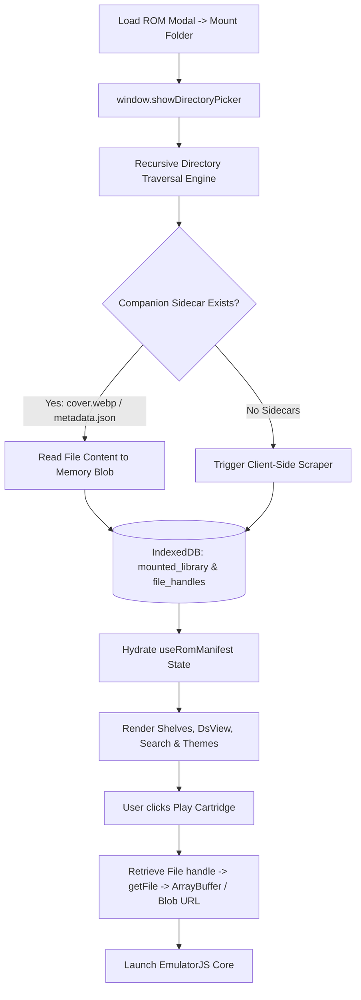

# Local Directory Library & Client-Side Scraping (`architecture/mirai/local-directory-library.md`)

## 1. Description

The **Local Directory Library & Client-Side Scraping** specification outlines the architecture for mounting a user's local ROM folder directly in the browser via the Native File System Access API (`window.showDirectoryPicker()`) with fallback to directory inputs (`<input webkitdirectory>`).

This architecture operates **100% client-side**, requiring zero server infrastructure or backend endpoints. Users visiting the static GitHub Pages deployment can point Retro Player to their local games folder, auto-index multi-system collections, ingest existing sidecar artwork (`cover.webp`, `metadata.json`), trigger client-side metadata scraping for missing titles, and persist the entire catalog in browser `IndexedDB`.

---

## 2. Detailed List of What It Will Do

### User-Facing Features
- **"Mount ROMs Directory" Button in Load ROM Modal**:
  - Adds a prominent option in `LoadRomModal.jsx` allowing users to choose an entire directory on their computer/handheld (e.g. `D:\Emulation\ROMs` or `~/Games/ROMs`).
- **Recursive Multi-System Catalog Scanning**:
  - Automatically scans subfolders or root directories, detecting platforms from file extensions (`.gba`, `.sfc`, `.nes`, `.nds`, `.z64`, `.md`, `.gb`, `.gbc`, `.iso`, `.chd`, `.zip`, `.7z`).
- **Sidecar Metadata & Artwork Auto-Ingestion**:
  - If a folder contains local companion assets (`cover.webp`, `boxart.png`, `metadata.json`), the browser parses them directly into memory and caches them into IndexedDB without making external web requests.
- **On-the-Fly Client-Side Metadata Scraping**:
  - For unindexed or loose ROMs lacking companion assets, the browser initiates the client-side metadata scraper (OpenVGDB / IGDB proxy / ScreenScraper hash match) to pull high-res 3D box art, descriptions, release years, and developer metadata.
- **Persistent Library Storage (Zero Re-Picking on Reload)**:
  - Stores directory and file handles in `IndexedDB` (under a dedicated `mounted_directories` store).
  - When returning to the website, the user's mounted library remains available in the shelf, cartridge grid, search, and favorites.
- **Direct Emulation Streaming**:
  - Clicking "Play" retrieves the file slice directly from the local file handle and mounts it into the EmulatorJS core with zero upload or network latency.

---

## 3. Detailed Logic Behind It

### Flow Architecture



### Technical Logic & State Management

1. **Directory Traversal & Permissions**:
   ```javascript
   // Request directory handle with read permission
   const dirHandle = await window.showDirectoryPicker({ mode: 'read' });
   
   // Check / request persistent permission
   async function verifyPermission(fileHandle) {
     const options = { mode: 'read' };
     if ((await fileHandle.queryPermission(options)) === 'granted') return true;
     if ((await fileHandle.requestPermission(options)) === 'granted') return true;
     return false;
   }
   ```

2. **Parsing System & ROMs**:
   - Traverses directories iteratively.
   - Normalizes titles using filename cleaners (removing tags like `(USA)`, `[!]`, `(Rev 1)`).
   - Associates companion files: if `game.gba` is found alongside `game.png` or `game.json` (or inside a subfolder containing `cover.webp` and `metadata.json`), they are linked under a single game object.

3. **IndexedDB Schema Extension (`services/db.js`)**:
   - Store: `mounted_library`
     - Key: `gameId` (hash or `systemKey-normalizedTitle`)
     - Value: `{ id, title, systemKey, systemName, systemCore, coverBlobUrl, metadata, fileHandle, isMounted: true }`
   - Store: `mounted_handles`
     - Key: `directoryName`
     - Value: `{ handle: dirHandle, name: dirHandle.name, addedAt: timestamp }`

4. **WebAssembly Archive Extraction (`.zip`, `.7z`)**:
   - Uses client-side `fflate` / `libarchive.js` to inspect compressed packages, detect valid ROM payloads within the archive, and pass uncompressed buffers directly to the emulator.

---

## 4. Detailed Guide of How to Set It Up

1. **Create File System Service**:
   - Create `src/services/localDirectoryService.js` handling `showDirectoryPicker`, recursive traversal, handle serialization, and permission verification.
2. **Update Database Adapter (`src/services/db.js`)**:
   - Add stores: `mounted_library` and `mounted_handles`.
3. **Extend `useRomManifest.js` Hook**:
   - Merge local mounted library entries with static bundled catalog games (`/public/roms`) and deduplicate.
4. **Update `LoadRomModal.jsx`**:
   - Add "Mount Local ROM Folder" action button with gamepad and keyboard navigation support.
   - Include folder indexing progress HUD and error handling for unsupported browsers (`<input webkitdirectory>` fallback).
5. **Verify GitHub Pages Compatibility**:
   - Validate that everything runs in-browser on static hosting with zero server requirements.
