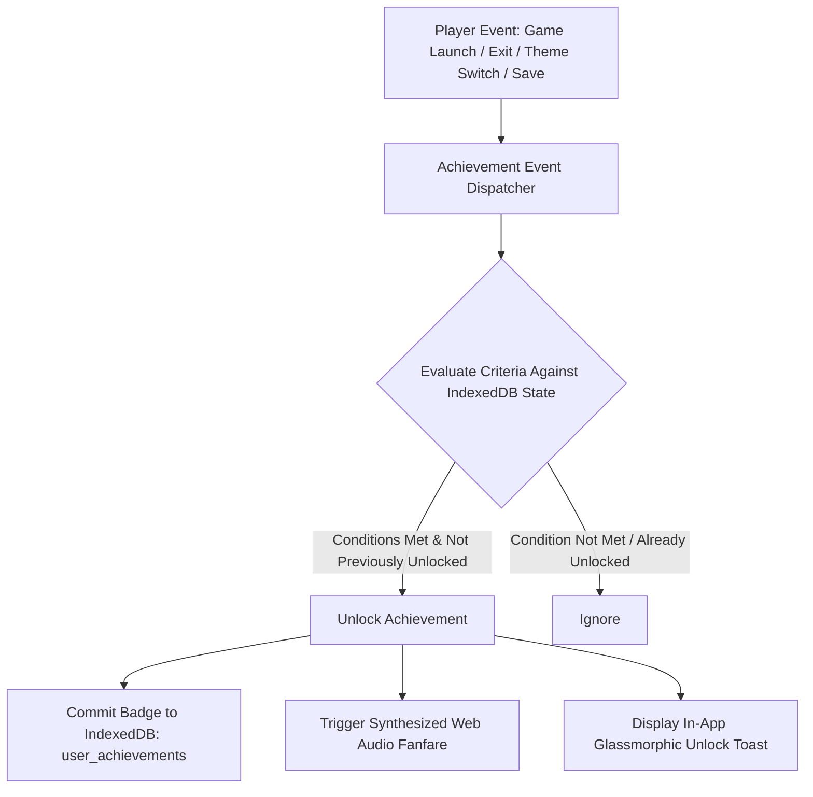

# Organic Achievements & Player Milestones Engine (`architecture/mirai/organic-achievements.md`)

## 1. Description

The **Organic Achievements & Player Milestones Engine** provides a built-in, 100% universal retro gamification system for Retro Player.

Unlike external services that rely on emulator memory hacking or game-specific checkpoints, this system creates **organic, client-side achievements** that work universally across every retro platform and game in your collection. It rewards exploration, milestone gaming sessions, library curation, and lighthearted gaming habits with customized in-app toast banners, chiptune sound chimes, and an interactive trophies showcase cabinet.

---

## 2. Detailed List of What It Will Do

### Achievement Categories & Milestones

#### 🎮 First Steps & Exploration
- **"Insert Coin"**: Launch your very first retro game in Retro Player.
- **"Console Hopper"**: Play at least one game across 3 different retro consoles.
- **"Full Spectrum"**: Play at least one game across all supported systems (NES, SNES, GBA, GBC, GB, N64, NDS, Genesis, PS1).
- **"Library Tourist"**: Launch 5 different games in a single session.
- **"Cartridge Collector"**: Have over 25 games indexed in your mounted library.

#### ⏱️ Playtime & Dedication
- **"Marathon Runner"**: Play a single game continuously for over 1 hour.
- **"Night Owl Gamer"**: Play any retro game between 1:00 AM and 4:00 AM.
- **"Century Club"**: Accumulate over 10 hours of total retro playtime.
- **"Daily Ritual"**: Launch Retro Player 3 consecutive days in a row.

#### 🕹️ Fun & Quirky Retro Habits
- **"Rage Quit?" / "Instant Regret"**: Open a game and quit in under 60 seconds.
- **"Indecisive Cartridge Swapper"**: Launch 3 different games in under 3 minutes.
- **"Nostalgia Critic"**: Spend more than 5 minutes browsing the menu shelves and listening to BGM without launching a game.
- **"Quick Saver"**: Use the Quick Save feature for the first time.
- **"Time Traveler"**: Use the Quick Load feature to reload a save state.

#### 🎨 Customization & Profile
- **"Identity Crisis"**: Change your profile avatar 3 times in the Multiavatar studio.
- **"Chameleon"**: Switch between Vanilla and DS Touch themes or cycle light/dark modes 5 times.
- **"Gold Star Curator"**: Add 5 or more games to your Favorites collection.

### UI & Audio Feedback
- **Glassmorphic Unlock Banner**: Floating top/bottom console HUD banner with milestone icon, achievement title, and unlock description.
- **Synthesized Web Audio Chime**: Distinct triumphant acoustic arpeggio synthesized via `useWebAudioSfx.js` upon achievement unlock.
- **Trophy Showcase Modal**: Interactive trophy room accessible from the user profile avatar, displaying unlocked vs locked badges, unlock timestamps, and completion progress percentage.

---

## 3. Detailed Logic Behind It

### Flow Architecture

### State Storage & Evaluator Engine

1. **IndexedDB Store (`services/db.js`)**:
   - Store: `achievements`
   - Key: `${profileId}_${achievementId}`
   - Value: `{ id, title, description, category, icon, unlockedAt: timestamp }`

2. **Event Listener Hooks**:
   - `onGameLaunched(game, startTime)`
   - `onGameExited(game, elapsedSeconds)`
   - `onQuickSave()` / `onQuickLoad()`
   - `onThemeChanged()` / `onAvatarUpdated()`

---

## 4. Detailed Guide of How to Set It Up

1. **Define Achievement Manifest (`src/data/achievementsManifest.js`)**:
   - Central registry of achievement IDs, icons, titles, descriptions, and condition evaluators.
2. **Create Achievements Hook (`src/hooks/useAchievements.js`)**:
   - Listens to app/emulator state changes and evaluates trigger rules.
3. **Build UI Toast & Showcase**:
   - Create `src/components/AchievementToast.jsx` for the in-game notification HUD.
   - Create `src/components/TrophyCabinetModal.jsx` for viewing earned trophies and progress.
