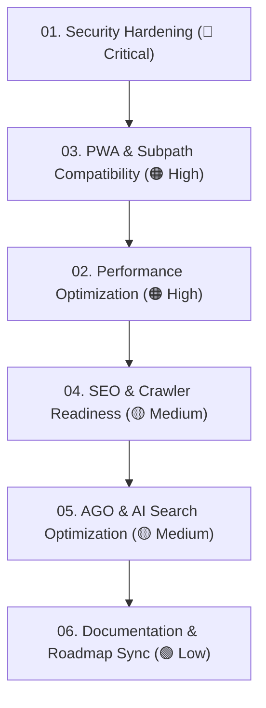

# 🛡️ Audit Hub — 2026-09-02 (Full-System Master Audit)

> Comprehensive architectural, security, performance, SEO, AI search optimization (AGO), and PWA audit conducted on **September 2, 2026**.
>
> Use this hub and its decoupled action specifications to review, prioritize, and execute remediation step-by-step.

---

## 📊 Master Scorecard & Severity Matrix

| Area | Grade | Severity | Primary Concerns | Specification Document | Status |
| :--- | :---: | :---: | :--- | :--- | :---: |
| **1. Security** | **C-** | 🚨 Critical | Path traversal file deletion, SSRF proxy vector, CORS wildcard, Docker root | **[01-security-hardening.md](01-security-hardening.md)** | 📋 Pending |
| **2. Performance** | **B-** | 🟠 High | Font `@import` waterfall, unused Google font, monolithic bundle (no lazy load) | **[02-performance-optimization.md](02-performance-optimization.md)** | 📋 Pending |
| **3. PWA & Subpath** | **B-** | 🟠 High | Service Worker subpath mismatch, offline emulator fallback 404, `/api/` fetch routing | **[03-pwa-subpath-compatibility.md](03-pwa-subpath-compatibility.md)** | 📋 Pending |
| **4. SEO & Crawlers** | **B** | 🟡 Medium | Missing canonical tag, missing JSON-LD structured data, empty SPA `<noscript>` | **[04-seo-and-crawler-readiness.md](04-seo-and-crawler-readiness.md)** | 📋 Pending |
| **5. AGO / AEO / ASO** | **B** | 🟡 Medium | Missing `llms-full.txt`, missing AI discovery tag, W3C manifest ID subpath bug | **[05-ago-and-ai-search-optimization.md](05-ago-and-ai-search-optimization.md)** | 📋 Pending |
| **6. Documentation** | **B+** | 🟢 Low | Broken README links, missing LICENSE file, table discrepancies, mirai sync | **[06-documentation-and-roadmap-sync.md](06-documentation-and-roadmap-sync.md)** | 📋 Pending |

---

## 🗓️ Recommended Execution Order

1. **Phase 1 — Security**: Immediate danger mitigation (close arbitrary file deletion endpoints, secure scrape proxy, add HTTP security headers, drop root user in Docker).
2. **Phase 2 — PWA & Subpaths**: Fix Service Worker subpath handling and offline emulator 404 bugs to guarantee Tri-Environment stability.
3. **Phase 3 — Performance**: Remove render-blocking `@import` font loading, configure Rollup chunk splitting, lazy-load heavy modals, and guard rAF gamepad polling.
4. **Phase 4 — SEO**: Add canonical link, Schema.org `WebApplication` structured data, and `<noscript>` fallback.
5. **Phase 5 — AGO / AI Search**: Implement `llms-full.txt`, AI discovery meta links, and W3C manifest store parity.
6. **Phase 6 — Docs & Sync**: Fix broken links, add MIT `LICENSE`, synchronize `mirai/` and `guides/` indices.

---

## ✅ Master Interactive Checklist

### 🚨 Security Hardening (`01-security-hardening.md`)
- [x] Implement `safeResolve` path boundary guard for `/api/delete-rom` ([server.js](file:///Users/godarayudhvir/Github/retro-player/server.js) & [vite.config.js](file:///Users/godarayudhvir/Github/retro-player/vite.config.js))
- [x] Implement `safeResolve` path boundary guard for `/api/delete-bgm`
- [x] Implement `safeResolve` path boundary guard for `/api/metadata/delete-sidecar` & `/api/metadata/save-sidecar`
- [ ] Whitelist upstream proxy domains in `/api/scrape-proxy` to prevent SSRF
- [x] Add standard Express HTTP security headers (`X-Content-Type-Options`, `X-Frame-Options`, `Referrer-Policy`, `Permissions-Policy`)
- [ ] Restrict wildcard CORS to origin verification on mutating API endpoints
- [x] Add `USER node` to [Dockerfile](file:///Users/godarayudhvir/Github/retro-player/Dockerfile) runtime stage
- [x] Add `.env`, `test_save_states/`, and `marketing/` to [.dockerignore](file:///Users/godarayudhvir/Github/retro-player/.dockerignore)

### 🟠 Performance Optimization (`02-performance-optimization.md`)
- [x] Remove blocking `@import` from [src/index.css](file:///Users/godarayudhvir/Github/retro-player/src/index.css)
- [x] Remove unused `Plus Jakarta Sans` font from [index.html](file:///Users/godarayudhvir/Github/retro-player/index.html)
- [x] Add preconnect and link tags for `Fredoka` & `Nunito` in [index.html](file:///Users/godarayudhvir/Github/retro-player/index.html)
- [ ] Lazy-load heavy modals with `React.lazy()` and `Suspense` in [src/App.jsx](file:///Users/godarayudhvir/Github/retro-player/src/App.jsx)
- [ ] Configure `manualChunks` in [vite.config.js](file:///Users/godarayudhvir/Github/retro-player/vite.config.js) for vendor separation
- [ ] Guard `requestAnimationFrame` gamepad polling loop in [src/hooks/useGamepadNavigation.js](file:///Users/godarayudhvir/Github/retro-player/src/hooks/useGamepadNavigation.js)

### 🟠 PWA & Subpath Compatibility (`03-pwa-subpath-compatibility.md`)
- [ ] Fix Service Worker path matching for subpaths (`.includes('/emulatorjs/')` and `.includes('/api/')`) in [public/sw.js](file:///Users/godarayudhvir/Github/retro-player/public/sw.js)
- [ ] Fix offline EmulatorJS fallback URL using `resolveAssetPath` in [src/components/EmulatorModal.jsx](file:///Users/godarayudhvir/Github/retro-player/src/components/EmulatorModal.jsx)
- [ ] Introduce subpath-aware `apiFetch()` helper for client API requests
- [ ] Remove heavy showcase screenshot files from `PRECACHE_ASSETS` in [public/sw.js](file:///Users/godarayudhvir/Github/retro-player/public/sw.js)
- [ ] Add in-app PWA update notification hook in [src/hooks/usePwaInstall.js](file:///Users/godarayudhvir/Github/retro-player/src/hooks/usePwaInstall.js)

### 🟡 SEO & Crawler Readiness (`04-seo-and-crawler-readiness.md`)
- [x] Add `<link rel="canonical" href="https://godarayudhvir.github.io/retro-player/" />` in [index.html](file:///Users/godarayudhvir/Github/retro-player/index.html)
- [x] Add Schema.org `WebApplication` / `VideoGame` JSON-LD structured data in [index.html](file:///Users/godarayudhvir/Github/retro-player/index.html)
- [x] Add semantic `<noscript>` crawler fallback with feature directory in [index.html](file:///Users/godarayudhvir/Github/retro-player/index.html)
- [x] Refresh [public/sitemap.xml](file:///Users/godarayudhvir/Github/retro-player/public/sitemap.xml) with modern dates and guide URLs

### 🟡 AGO / AI Engine & App Store Optimization (`05-ago-and-ai-search-optimization.md`)
- [ ] Generate comprehensive [public/llms-full.txt](file:///Users/godarayudhvir/Github/retro-player/public/llms-full.txt) for LLM ingestion
- [x] Add `<link rel="alternate" type="text/markdown" href="./llms.txt" />` in [index.html](file:///Users/godarayudhvir/Github/retro-player/index.html)
- [ ] Update [public/manifest.webmanifest](file:///Users/godarayudhvir/Github/retro-player/public/manifest.webmanifest) `"id": "./"` to avoid subpath domain collisions
- [ ] Add `lang: "en"`, `dir: "ltr"`, and international store rating fields to [public/manifest.webmanifest](file:///Users/godarayudhvir/Github/retro-player/public/manifest.webmanifest)

### 🟢 Documentation & Roadmap Sync (`06-documentation-and-roadmap-sync.md`)
- [x] Fix broken link `guides/device-experience-matrix.md` &rarr; `guides/device-matrix.md` in [README.md](file:///Users/godarayudhvir/Github/retro-player/README.md)
- [x] Create missing root [LICENSE](file:///Users/godarayudhvir/Github/retro-player/LICENSE) file (GPL-3.0)
- [x] Remove broken/completed `mirai/` references from [README.md](file:///Users/godarayudhvir/Github/retro-player/README.md)
- [x] Add [guides/compatibility.md](file:///Users/godarayudhvir/Github/retro-player/guides/compatibility.md) to master index table in [guides/README.md](file:///Users/godarayudhvir/Github/retro-player/guides/README.md)
- [x] Add [mirai/cartridge-designs-spec.md](file:///Users/godarayudhvir/Github/retro-player/mirai/cartridge-designs-spec.md) to [mirai/README.md](file:///Users/godarayudhvir/Github/retro-player/mirai/README.md)
- [x] Update Pokémon Save Inspector summary in [README.md](file:///Users/godarayudhvir/Github/retro-player/README.md) to reflect Gen 5 Unova
