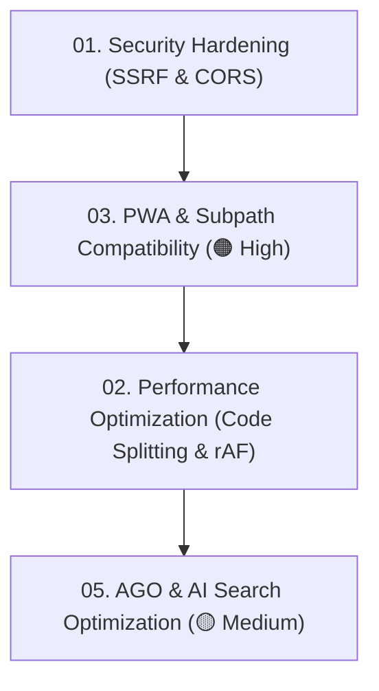

# 🛡️ Audit Hub — 2026-09-02 (Full-System Master Audit)

> Comprehensive architectural, security, performance, SEO, AI search optimization (AGO), and PWA audit conducted on **September 2, 2026**.
>
> Use this hub and its decoupled action specifications to review, prioritize, and execute remediation step-by-step.

---

## 📊 Master Scorecard & Severity Matrix

| Area | Grade | Severity | Primary Concerns | Specification Document | Status |
| :--- | :---: | :---: | :--- | :--- | :---: |
| **1. Security** | **B** | 🚨 Critical | SSRF proxy vector, CORS wildcard on mutating endpoints | **[01-security-hardening.md](01-security-hardening.md)** | 📋 Pending |
| **2. Performance** | **B+** | 🟠 High | Monolithic bundle code-splitting (React.lazy modals), rAF gamepad polling | **[02-performance-optimization.md](02-performance-optimization.md)** | 📋 Pending |
| **3. PWA & Subpath** | **B-** | 🟠 High | Service Worker subpath mismatch, offline emulator fallback 404, `/api/` fetch routing | **[03-pwa-subpath-compatibility.md](03-pwa-subpath-compatibility.md)** | 📋 Pending |
| **4. AGO / AEO / ASO** | **B+** | 🟡 Medium | Missing `llms-full.txt`, W3C manifest ID subpath bug, international store fields | **[05-ago-and-ai-search-optimization.md](05-ago-and-ai-search-optimization.md)** | 📋 Pending |

---

## 🗓️ Recommended Execution Order

---

## ✅ Master Interactive Checklist (Pending Items)

### 🚨 Security Hardening (`01-security-hardening.md`)
- [ ] Whitelist upstream proxy domains in `/api/scrape-proxy` to prevent SSRF
- [ ] Restrict wildcard CORS to origin verification on mutating API endpoints

### 🟠 Performance Optimization (`02-performance-optimization.md`)
- [ ] Lazy-load heavy modals with `React.lazy()` and `Suspense` in [src/App.jsx](file:///Users/godarayudhvir/Github/retro-player/src/App.jsx)
- [ ] Configure `manualChunks` in [vite.config.js](file:///Users/godarayudhvir/Github/retro-player/vite.config.js) for vendor separation
- [ ] Guard `requestAnimationFrame` gamepad polling loop in [src/hooks/useGamepadNavigation.js](file:///Users/godarayudhvir/Github/retro-player/src/hooks/useGamepadNavigation.js)

### 🟠 PWA & Subpath Compatibility (`03-pwa-subpath-compatibility.md`)
- [ ] Fix Service Worker path matching for subpaths (`.includes('/emulatorjs/')` and `.includes('/api/')`) in [public/sw.js](file:///Users/godarayudhvir/Github/retro-player/public/sw.js)
- [ ] Fix offline EmulatorJS fallback URL using `resolveAssetPath` in [src/components/EmulatorModal.jsx](file:///Users/godarayudhvir/Github/retro-player/src/components/EmulatorModal.jsx)
- [ ] Introduce subpath-aware `apiFetch()` helper for client API requests
- [ ] Remove heavy showcase screenshot files from `PRECACHE_ASSETS` in [public/sw.js](file:///Users/godarayudhvir/Github/retro-player/public/sw.js)
- [ ] Add in-app PWA update notification hook in [src/hooks/usePwaInstall.js](file:///Users/godarayudhvir/Github/retro-player/src/hooks/usePwaInstall.js)

### 🟡 AGO / AI Engine & App Store Optimization (`05-ago-and-ai-search-optimization.md`)
- [ ] Generate comprehensive [public/llms-full.txt](file:///Users/godarayudhvir/Github/retro-player/public/llms-full.txt) for LLM ingestion
- [ ] Update [public/manifest.webmanifest](file:///Users/godarayudhvir/Github/retro-player/public/manifest.webmanifest) `"id": "./"` to avoid subpath domain collisions
- [ ] Add `lang: "en"`, `dir: "ltr"`, and international store rating fields to [public/manifest.webmanifest](file:///Users/godarayudhvir/Github/retro-player/public/manifest.webmanifest)
