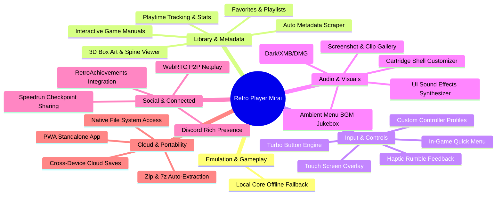

# 🔮 MIRAI (未来) — The Grand Vision & Master Blueprint

> **"Mirai" (未来)** is the Japanese word for **"Future"**. This document represents the comprehensive architectural roadmap, feature catalog, technical audit, and grand vision for the evolution of **Retro Player** from a sleek web emulator launcher into the ultimate, next-generation retro gaming operating environment.

---

## 🧭 Executive Summary & Design Vision

Retro Player bridges the tactile nostalgia of 90s/2000s physical gaming cartridges with the cutting-edge fluidity of modern handheld gaming operating systems (inspired by Nintendo Switch OS, SteamOS, Sony XMB, and the homebrew *iiSU* interface).

### Core Pillars of the Mirai Vision:
1. **Tactile Skeuomorphism Meets Modern UI**: Physical 3D cartridges, dynamic sheen reflections, metallic shells, authentic cartridge insert sounds, and glassmorphic HUDs.
2. **Zero-Friction Emulation**: Drop-in ROM execution, automated cover art & metadata scraping, cross-system core auto-detection, and offline PWA reliability.
3. **Handheld & Console-First Usability**: 100% controller-driven spatial navigation, hotkey combos, virtual touch controls for mobile/tablets, and seamless multi-controller multiplayer.
4. **Preservation & Modern Convenience**: State-of-the-art save sync across devices, RetroAchievements gamification, CRT/LCD shader authenticity, cheat engines, and rewind buffers.

---

## 📌 Deliverables Status & Tracking

- [x] **In-Game Gamepad Support & Navigation**: Web Gamepad API integration for UI shell navigation (D-Pad, Left Stick, Shoulder buttons), dedicated controller exit shortcuts (`Select + Start`, `Guide/PS`, `L3 + R3`), hardware index lookup patch, live in-game button mapping engine in EmulatorJS, and glassmorphic On-Screen Virtual Keyboard (`Y` / `Select`).
- [x] **Saves Battery & Export Feature**: Live save data detection (`IndexedDB` & `LocalStorage`) in game drawer, export save states (`.state`) and SRAM/battery save files (`.sav`) via HUD action button.
- [x] **Modular Architecture & Component Decomposition**: Clean separation of `App.jsx` (< 200 lines) into dedicated subcomponents (`Topbar`, `SystemRibbon`, `CartridgeGrid`, `CartridgeTile`, `GameDetailModal`, `AboutInfoModal`, `DropzoneOverlay`, `ConsoleHud`) and custom hooks (`useWebAudioSfx`, `useGamepadStatus`, `useSaveDataManager`, `useRomManifest`, `useGamepadNavigation`).
- [x] **Tactile Web Audio UI Sound Effects**: Pure Web Audio API acoustic synthesis with zero external MP3 assets (tactile navigation ticks, shoulder swooshes, modal chimes, and mechanical cartridge insert "click-clacks" with boot chord).
- [ ] **Offline Core Resilience & Local Self-Hosting**: Offline fallback to `/public/emulatorjs/data/` for 100% air-gapped gameplay without CDN dependencies (Section 1.1).
- [ ] **Automated Metadata & Cover Art Scraper**: Online fetching from ScreenScraper, IGDB, or OpenVGDB API for high-res 3D box art, screenshots, developer info, and gameplay previews (Section 2.1).
- [ ] **Touch Screen Gamepad Overlay**: Virtual on-screen D-Pad and action buttons with haptic touch feedback for mobile and tablets (Section 3.1).
- [ ] **Ambient Menu BGM Jukebox**: Curated ambient console background music with auto-ducking on launch (Section 4.2).
- [ ] **RetroAchievements (RA) Full Integration**: RetroAchievements API authentication, in-game badge unlock popups, hardcore points, and leaderboards (Section 5.1).
- [ ] **WebRTC Peer-to-Peer Netplay**: Zero-server P2P multiplayer room creation, low-latency DataChannels, and input rollback (Section 5.2).
- [ ] **Discord Rich Presence (DRP)**: Real-time Discord status broadcasting for current retro game title, platform, and playtime (Section 5.3).
- [ ] **Cross-Device Cloud Save Synchronization**: Bi-directional save state & battery RAM backup to Google Drive, Dropbox, or WebDAV (Section 6.1).
- [ ] **Progressive Web App (PWA)**: Standalone installable application with offline service worker caching (Section 6.2).

---

## 🔍 In-Depth Codebase Audit & Gap Analysis

A rigorous inspection of the current codebase reveals both foundational strengths and high-value opportunities for technical refinement and innovation:

```
Current Codebase Surface:
├── src/App.jsx                     # 168 lines (Clean Root Orchestrator)
├── src/components/
│   ├── Topbar.jsx                  # Status HUD, search bar, sound toggle & clock
│   ├── SystemRibbon.jsx            # Dynamic console category ribbon
│   ├── CartridgeGrid.jsx           # 3D Cartridge grid viewport
│   ├── CartridgeTile.jsx           # Physical 3D cartridge with sheen & grips
│   ├── GameDetailModal.jsx         # Game drawer with save data detection
│   ├── AboutInfoModal.jsx          # About dialog & controls reference
│   ├── DropzoneOverlay.jsx         # Drag-and-drop custom ROM backdrop
│   ├── ConsoleHud.jsx              # Bottom controller button hints
│   ├── EmulatorModal.jsx           # Isolated Iframe & EmulatorJS Glue
│   ├── OnScreenKeyboard.jsx        # Spatial OSK for Search
│   └── ErrorBoundary.jsx           # Fatal Error Catching
├── src/hooks/
│   ├── useWebAudioSfx.js           # Web Audio API sound synthesizer
│   ├── useGamepadStatus.js         # HTML5 Gamepad connection tracking
│   ├── useSaveDataManager.js       # LocalStorage & IndexedDB save detection
│   ├── useRomManifest.js           # Manifest fetching & ROM drop-in loader
│   └── useGamepadNavigation.js     # Spatial 2D navigation & gamepad polling
├── src/utils/
│   ├── cartridgeColors.js          # Cartridge shell color heuristics
│   └── systemDetector.js           # ROM extension to emulator core detection
├── src/gameDescriptions.js         # Static Metadata Fallback
├── src/index.css                   # Design Tokens & Cartridge 3D CSS
├── vite.config.js                  # Multi-Console Scanner Middleware
└── public/emulatorjs/data/         # Local emulator assets
```

### 📊 Codebase Strengths & Bottlenecks Matrix

| Component / Subsystem | Current State & Strength | Bottleneck / Technical Debt | Mirai Transformation Goal |
| :--- | :--- | :--- | :--- |
| **`App.jsx`** | Modular root orchestrator with dedicated subcomponents & hooks | Fully decomposed into clean subcomponents and hooks | Maintain modularity for upcoming features (P2P, cloud saves, themes) |
| **Emulator Engine** | Isolated iframe sandbox preventing DOM/event collisions | Hardcoded external CDN path (`cdn.emulatorjs.org`); no offline fallback | Support local `/emulatorjs/data/` fallback, offline PWA cache, and shader toggles |
| **Metadata & Covers** | Fuzzy local cover art scanner (`public/cover/*`) | Falls back to static Pokeball if no local art exists; manual metadata entries | Automated online metadata scraper (ScreenScraper / IGDB / Libretro Thumbnails API) |
| **Save Management** | Basic `.sav` file export button and IndexedDB detection | No multi-slot save state UI, no visual snapshot previews, no cloud backup | 5-slot Save State Manager with screenshot thumbnails and cloud auto-sync |
| **Input Engine** | Spatial D-Pad navigation, exit combos (`Select+Start`) | No virtual touch controls for mobile/tablet; no haptic rumble API integration | On-screen touch D-Pad/action overlay, rumble haptics, and custom controller remapping |
| **Sound & Audio** | Browser default audio in emulator | Completely silent UI navigation shell; no ambient menu music or tactile clicks | Web Audio API UI sound synthesizer (clicks, swooshes, cartridge load) & ambient BGM |
| **Visual Immersion** | Realistic 3D cartridge tiles with sheen and colors | Single default light theme; no in-game CRT/LCD shader presets HUD | Multi-theme system (Switch Dark, PS5 XMB, Cyberpunk) + In-game CRT/Scanline HUD |
| **Multiplayer** | Single-player local focus | No peer-to-peer online play or lobby matchmaking | WebRTC P2P Netplay with zero-server rollback input synchronization |

---

## 🚀 The Mirai Feature Innovation Catalog



---

## 1. 🕹️ Emulation Core & Gameplay Mechanics

### 1.1 Offline Core Resilience & Local Self-Hosting
- **Current Limitation**: `cdn.emulatorjs.org` dependency fails when offline or during CDN downtime.
- **Mirai Solution**:
  - Dual-mode core loader: Automatically test CDN availability; if offline, gracefully switch to `/public/emulatorjs/data/` local engine.
  - Bundle core WebAssembly files (`desmume.wasm`, `mgba.wasm`, `snes9x.wasm`, `pcsx.wasm`) locally for 100% air-gapped play.

---

## 2. 📚 Library, Metadata & Scraping Intelligence

```
+-------------------------------------------------------------------------------+
| AUTOMATED METADATA & ASSET SCRAPING PIPELINE                                  |
|                                                                               |
|  [ROM File: "Pokemon Emerald.gba"]                                            |
|                │                                                              |
|                ├──► 1. SHA-1 / MD5 Hash Lookup (OpenVGDB / ScreenScraper)     |
|                │                                                              |
|                ├──► 2. High-Res 3D Box Art & Cartridge Sticker Asset Fetch     |
|                │                                                              |
|                ├──► 3. Metadata Injection (Release Date, Dev, Genre, Summary) |
|                │                                                              |
|                └──► 4. Local Cache Storage (IndexedDB + /public/assets/cover) |
+-------------------------------------------------------------------------------+
```

### 2.1 Automated Online Cover Art & Metadata Scraper
- **Current Limitation**: Missing cover art defaults to a placeholder icon; descriptions are hardcoded in `gameDescriptions.js`.
- **Mirai Solution**:
  - Integrate an automated background scraper communicating with **ScreenScraper**, **IGDB**, **TheGamesDB**, and **Libretro Thumbnails**.
  - Compute ROM checksums (MD5/SHA1) to pull accurate release data:
    - Official 3D Box Art, Cartridge Art, Title Screen & In-Game Action Screenshots.
    - Developer, Publisher, Release Date, Number of Players, Genre, and ESRB rating.
    - Official plot synopsis and synopsis translation.
  - Include an interactive **"Scrape Missing Art"** action button in the topbar.

### 2.2 Smart Collections, Favorites & Custom Tags
- **Current Limitation**: Filtering is limited strictly to system tabs and search queries.
- **Mirai Solution**:
  - System ribbon expansion with custom smart playlists:
    - ⭐ **Favorites**: Quick-toggle favorite games with `X` button on controller.
    - 🕒 **Recently Played**: Chronologically sorted list of your latest gaming sessions.
    - 🏆 **Completed / Backlog**: User-assigned status badges ("Playing", "Completed", "Mastered", "Backlog").
    - 👥 **Multiplayer Ready**: Filters titles supporting 2-4 players.
  - Custom user playlists (e.g., "Pokémon Romhacks", "90s RPG Essentials", "Arcade Classics").

### 2.3 Comprehensive Playtime Analytics & Stats Dashboard
- **Current Limitation**: No tracking of playtime or launch count.
- **Mirai Solution**:
  - Persistent tracking stored in `localStorage` / `IndexedDB`:
    - Total Hours & Minutes Played per game and per system.
    - Last session timestamp, launch count, and average session length.
  - **"Year in Retro" / Stats Modal**: Visual analytics showcasing most played system, top 5 games, and total retro milestones achieved.

### 2.4 Interactive Game Manuals & Strategy Guide Flipbook
- **Current Limitation**: Players must leave the app to look up control schemes or maps.
- **Mirai Solution**:
  - Built-in PDF and high-res image flipbook viewer inside the Game Detail Modal.
  - Automatically pair with community manual archives (e.g., *ReplacementDocs*, *Vimm's Lair Manual Archive*).
  - Full gamepad navigation: Shoulder buttons (`L1`/`R1`) flip pages, stick zooms and pans.

---

## 3. 🎮 Input, Gamepad & Handheld Controls

### 3.1 Touch-Screen Gamepad Overlay for Mobile & Tablets
- **Current Limitation**: Mobile/iPad users can browse the library but cannot easily play without a connected physical controller or keyboard.
- **Mirai Solution**:
  - Responsive, glassmorphic **Virtual Touch Controller**:
    - Floating ergonomic D-Pad with analog slide emulation.
    - Pressure-responsive `A`, `B`, `X`, `Y`, `L`, `R`, `Start`, and `Select` buttons.
    - Auto-hide on inactivity or when physical gamepad/keyboard is detected.
    - Haptic touch feedback using the `navigator.vibrate()` Web API.
    - Per-platform layout adaptation (e.g., 2-button layout for NES/GB, 4-button diamond for SNES/GBA, 6-button for Genesis).

```
+-------------------------------------------------------------------------------+
| RESPONSIVE VIRTUAL TOUCH OVERLAY LAYOUT                                       |
|                                                                               |
|   [L1]  [L2]                                                    [R2]  [R1]    |
|                                                                               |
|       ▲                                                       ( X )           |
|    ◄  ●  ►                 [SELECT]    [START]            ( Y )   ( A )       |
|       ▼                                                       ( B )           |
|                                                                               |
+-------------------------------------------------------------------------------+
```

### 3.2 Haptic Rumble Feedback (Web Gamepad Haptics API)
- **Current Limitation**: Vibration motors on modern controllers (Xbox, DualSense, Switch Pro) remain idle.
- **Mirai Solution**:
  - Hook into `gamepad.vibrationActuator.playEffect('dual-rumble', ...)` in supported emulator cores.
  - Trigger realistic haptics during in-game explosions, damage, rumble-pack events (N64, GBA Drill Dozer), and tactile UI navigation clicks.

### 3.3 Multi-Controller Profile Mapper & Visual Remapping Wizard
- **Current Limitation**: Controller mapping is adjusted through basic EmulatorJS menus.
- **Mirai Solution**:
  - Dedicated **Controller Configuration Studio**:
    - Interactive visual gamepad diagram showing button highlights as you press them.
    - Pre-calibrated mappings for Xbox Wireless, PlayStation DualShock/DualSense, Nintendo Switch Pro Controller, 8BitDo, and Joy-Cons.
    - Custom deadzone and analog sensitivity calibration.
    - Turbo / Rapid-Fire mode with customizable repeat frequency (5Hz - 30Hz).

### 3.4 In-Game Quick Access Pause Menu
- **Current Limitation**: Exiting a game exits directly to the library without intermediate options.
- **Mirai Solution**:
  - Pressing `Home` / `Guide` or `Select + Start` opens an in-game glassmorphic pause overlay:
    - **Resume Game**
    - **Save State** (Choose slot 1-5 with preview)
    - **Load State** (Choose slot 1-5 with preview)
    - **CRT & Video Filters** (Cycle live)
    - **Rewind 10 Seconds**
    - **Controller Mappings**
    - **Volume & Audio Balance**
    - **Quit to Library**

---

## 4. 🎨 Audio-Visual Immersion & UI/UX Themes

### 4.1 Tactile Web Audio UI Sound Effects & Chiptune Feedback
- **Current Limitation**: UI navigation is silent.
- **Mirai Solution**:
  - Pure Web Audio API synthesized sound suite (no external MP3 asset lag):
    - **Tile Navigation**: Soft tactile "tick" or bubble blip on D-Pad movement.
    - **Tab Switching**: Clean frequency swoosh on `L1`/`R1`.
    - **Game Launch**: Authentic retro cartridge "click-clack" insertion sound followed by a cheerful console boot chime.
    - **Modal Open/Close**: Subtle glass harmonic resonance.
    - Global volume and SFX toggle in the top status bar.

### 4.2 Ambient Menu BGM Jukebox
- **Current Limitation**: No ambient atmosphere in library view.
- **Mirai Solution**:
  - Optional ambient background music player:
    - Curated royalty-free lo-fi chiptune tracks and ambient console themes (Wii Shop, 3DS eShop, PS3 Wave aesthetic).
    - Audio ducking: Background music automatically fades out when launching a game and fades back in when returning to the library.

### 4.3 Multi-Theme Engine
- **Current Limitation**: Single bright iiSU-inspired theme.
- **Mirai Solution**:
  - Add customizable visual themes switchable via topbar toggle or gamepad shortcut:
    - ☀️ **iiSU Light (Default)**: Crisp porcelain white, subtle dot matrix, vibrant Nintendo colors.
    - 🌙 **Midnight Cyber (Dark Mode)**: Deep obsidian `#0a0d14`, neon cyan/magenta accents, dark glassmorphism.
    - 🎮 **Sony XMB / PS5 Dashboard**: Horizontal ribbon with flowing particle wave background and dynamic game hero banners.
    - 📟 **Game Boy DMG Classic**: Authentic monochromatic olive-green dot-matrix styling with pixelated typography.
    - 🕹️ **Neon Arcade Cabinet**: CRT scanline background with glowing retro vector grids.

```
+-------------------------------------------------------------------------------+
| THEME SYSTEM PREVIEWS                                                         |
|                                                                               |
|  [ iiSU Light ]     [ Midnight Cyber ]   [ Sony XMB Wave ]   [ DMG Classic ]  |
|  Clean White        Deep Obsidian Slate  Flowing Particles   Olive Matrix     |
|  Red / Blue Accent  Neon Cyan Glow       Horizontal Bar      Pixel Typography |
+-------------------------------------------------------------------------------+
```

### 4.4 3D Cartridge Shell & Label Customizer
- **Current Limitation**: Cartridge shell colors are auto-assigned by title keyword or platform color.
- **Mirai Solution**:
  - Interactive **Cartridge Studio**:
    - **Shell Materials**: Opaque Plastic, Translucent Smoke (Atomic Purple, Glacier Blue), Metallic Gold (*Zelda*), Glitter Sparkle (*Pokémon Ruby/Sapphire*).
    - **Cartridge Wear & Patina**: Pristine Mint, Lightly Played, Vintage Scratched label overlay.
    - **Custom Brand Stamps**: Nintendo Seal of Quality, Sega Quality Gold Stamp, Custom Gamer Tag.

### 4.5 Screenshot & Gameplay Recording Gallery
- **Current Limitation**: No native media capture.
- **Mirai Solution**:
  - Press `F12` or `Share` button on controller to capture full-resolution PNG screenshots.
  - Record up to 30-second WebM gameplay video clips.
  - Built-in **Media Gallery Modal** to view, share, or set custom screenshots as game cover art.

---

## 5. 🌐 Multiplayer, Social & Gamification

```
+-------------------------------------------------------------------------------+
| WEBRTC P2P NETPLAY ARCHITECTURE                                               |
|                                                                               |
|  [HOST PLAYER] (P1)                                [CLIENT PLAYER] (P2)       |
|    │                                                 │                        |
|    ├──► Creates Room (Code: "RETRO-492") ───────────►│ Joins via Link/Code    |
|    │                                                 │                        |
|    │◄── Low-Latency WebRTC DataChannel Connection ──►│                        |
|    │                                                 │                        |
|    ├── Emulates Game Frame Loop                      │                        |
|    ├── Streams Video/Audio (MediaStream / Data) ────►│ Renders Canvas         |
|    │◄── Receives P2 Controller State (0.01ms) ───────┤ Transmits Inputs       |
+-------------------------------------------------------------------------------+
```

### 5.1 RetroAchievements (RA) Full Integration
- **Current Limitation**: RetroAchievements authentication and badge display are not yet integrated into the frontend.
- **Mirai Solution**:
  - Authenticate with official RetroAchievements API (`username` + `webApiKey`).
  - Fetch game achievement list, badges, point values, and unlock conditions.
  - **Live In-Game Achievement Popups**: Gorgeous glassmorphic badge banner with sound effect upon unlocking a milestone.
  - **Profile Showcase Modal**: Track total Hardcore points, badge collection, and rank leaderboards.

### 5.2 Zero-Server WebRTC Peer-to-Peer Netplay
- **Current Limitation**: Emulation is single-device only.
- **Mirai Solution**:
  - Host creates a Netplay session and receives a 6-character room code (e.g., `RETRO-8080`) or shareable URL.
  - Client connects via WebRTC DataChannels using a lightweight WebSocket signaling bridge (or serverless QR code handshake).
  - Host streams emulation state buffers; client streams Player 2/3/4 controller inputs with input prediction and rollback.
  - Supports classic multiplayer titles: *Mario Kart 64*, *Super Smash Bros*, *Street Fighter II*, *TMNT: Turtles in Time*, *Pokémon Trade/Battle via GB Link Cable emulation*.

### 5.3 Discord Rich Presence (DRP) Bridge
- **Current Limitation**: No live status broadcasting.
- **Mirai Solution**:
  - Lightweight local Node bridge / Electron companion or WebSocket RPC protocol.
  - Displays:
    - **Game Title**: e.g., *The Legend of Zelda: The Minish Cap*
    - **System**: *Game Boy Advance* with official console icon
    - **Elapsed Playtime**: *Playing for 42 minutes*
    - **State**: *In Dungeon 3 - Exploring*

---

## 6. ☁️ Cloud Storage & Cross-Device Portability

### 6.1 Unified Cloud Save Synchronization
- **Current Limitation**: Saves reside exclusively in local browser storage (`IndexedDB` / `localStorage`).
- **Mirai Solution**:
  - Connect user's personal cloud storage provider:
    - **Google Drive** (via OAuth2)
    - **Dropbox**
    - **WebDAV / Nextcloud**
    - **Supabase / Self-Hosted S3 / MinIO Bucket**
  - **Automatic Bi-directional Sync**:
    - Saves battery RAM (`.sav`) and state snapshots upon game exit.
    - Smart conflict resolution prompt if a newer cloud save is found from another device (e.g., phone vs desktop).

```
+-------------------------------------------------------------------------------+
| CLOUD SAVE SYNC ENGINE FLOW                                                   |
|                                                                               |
|  [Active Game Session] ──► Exit Game (Select + Start)                         |
|                                │                                              |
|                                ├──► 1. Commit Battery RAM to IndexedDB        |
|                                ├──► 2. Generate GZIP Compressed Blob          |
|                                ├──► 3. Compute SHA-256 Checksum               |
|                                └──► 4. Upload to Cloud Provider (Drive/WebDAV)|
+-------------------------------------------------------------------------------+
```

### 6.2 Progressive Web App (PWA) & Offline Desktop Install
- **Current Limitation**: Runs strictly as an in-browser web app.
- **Mirai Solution**:
  - Add Web App Manifest (`manifest.json`) with gaming handheld display tags (`display: "standalone"`, `orientation: "landscape"`).
  - Service Worker caching all shell assets, icons, fonts, and local emulator cores for 100% offline functionality.
  - Installable as a native desktop/mobile app on macOS, Windows, Linux, Android, iOS, Steam Deck, and Odin 2.

### 6.3 Local File System Access API Integration
- **Current Limitation**: Adding ROMs requires placing files in `public/roms` or manual file picker uploads.
- **Mirai Solution**:
  - Use `window.showDirectoryPicker()` to link directly to an existing ROM directory on the user's hard drive (e.g., `D:\Emulation\Roms` or `/home/deck/Roms`).
  - Read files directly without copying into `public/`, retaining persistent folder permissions across reloads.

### 6.4 In-Browser Archive Auto-Extraction (`.zip`, `.7z`, `.rar`)
- **Current Limitation**: `.zip` ROMs are passed directly to cores; multi-file `.zip` or `.7z` archives can fail.
- **Mirai Solution**:
  - Integrate lightweight WebAssembly archive unpacker (`fflate` / `libarchive.js`).
  - Extract compressed ROM packages in memory, automatically selecting the correct primary ROM file and caching it.

---

## 7. 📱 Mobile, Tablet & Native Handheld Optimizations

### 7.1 Steam Deck, ROG Ally & Handheld Display Tuning
- **Current Limitation**: Default layout is optimized for desktop 1080p/1440p displays.
- **Mirai Solution**:
  - Dedicated **Handheld 720p/800p UI Mode**:
    - Compact UI scaling tailored specifically for 1280x800 / 1280x720 7-inch displays.
    - Large high-visibility focus rings and tactile navigation cards.
    - Full native integration with Steam Deck controller mapping.

### 7.2 Low-Battery & Performance Eco Mode
- **Current Limitation**: Polling loops run at full 60fps regardless of battery status.
- **Mirai Solution**:
  - Monitor `navigator.getBattery()`.
  - Automatically throttle UI animation frame rates and disable background blur effects when battery falls below 20% to maximize handheld battery life.

---

## 8. 🏗️ Codebase Architecture & Technical Refactorings

### 8.1 Component Decomposition Plan for `App.jsx`

To maintain clean repository hygiene and ensure effortless scalability, `src/App.jsx` should be decomposed into clean, specialized modular components:

```
src/
├── components/
│   ├── Topbar.jsx            # Header status bar, time, search bar, load ROM & info buttons
│   ├── SystemRibbon.jsx      # Dynamic console system tabs & shoulder button triggers
│   ├── CartridgeGrid.jsx     # 3D Cartridge grid with smooth scrolling & sheen effects
│   ├── CartridgeTile.jsx     # Individual 3D cartridge component with label & fallback logic
│   ├── GameDetailModal.jsx   # Game drawer with descriptions, save state status & play trigger
│   ├── AboutInfoModal.jsx    # About dialog & control guide tables
│   ├── DropzoneOverlay.jsx   # Drag-and-drop custom ROM backdrop overlay
│   ├── EmulatorModal.jsx     # Isolated EmulatorJS engine iframe & controller synchronization
│   ├── OnScreenKeyboard.jsx  # Spatial search virtual keyboard
│   ├── ShaderMenu.jsx        # In-game CRT / LCD shader preset switcher
│   └── ErrorBoundary.jsx     # Global exception catcher
│
├── hooks/
│   ├── useGamepadNavigation.js # Spatial 2D navigation matrix & D-Pad cooldown polling
│   ├── useGamepadStatus.js     # Connect/disconnect listener & active controller identity
│   ├── useRomManifest.js       # Manifest fetching, directory scan & search filtering
│   ├── useSaveDataManager.js   # IndexedDB / LocalStorage save state checker & exporter
│   └── useWebAudioSfx.js       # Synthesized UI sound effects generator
│
├── services/
│   ├── metadataScraper.js      # OpenVGDB / ScreenScraper API bridge
│   ├── cloudStorageService.js  # Google Drive / WebDAV save synchronization
│   └── webrtcNetplay.js        # PeerJS signaling & input buffer transmission
│
├── utils/
│   ├── cartridgeColors.js      # Cartridge shell color heuristics
│   └── systemDetector.js       # Extension & MIME system core matching
│
├── App.jsx                     # Clean, elegant root orchestrator (< 200 lines)
├── index.css                   # Theme tokens, 3D cartridge transforms & responsive layout
└── main.jsx                    # React 18 DOM mount point
```

### 8.2 Vitest Automated Test Suite
- Add automated unit tests with Vitest:
  - String cleaning and fuzzy cover art matching logic (`vite.config.js`).
  - Spatial navigation grid coordinate calculations (UP/DOWN/LEFT/RIGHT wrap-around logic).
  - Extension-to-system core detection and blob URL lifecycles.
  - IndexedDB save state serialization and deserialization.

---

## 📅 Prioritized Implementation Roadmap

```
PHASE 1: Quick Wins & Refactoring (1 - 2 Weeks)
├── Modularize App.jsx into subcomponents and custom hooks
├── Add Web Audio API synthesized UI sound effects (Clicks, Swooshes, Cartridge insert)
└── Add Local Core Offline Fallback (/public/emulatorjs/data/)

PHASE 2: Library & Control Enhancements (2 - 4 Weeks)
├── Integrate Automated Online Metadata & Cover Art Scraper
├── Implement Responsive Touch Screen Gamepad Overlay for Mobile/iPad
├── Add Multi-Theme Engine (Midnight Cyber Dark Mode & Sony XMB Wave)
├── Implement Favorites, Recently Played & Custom Tag Collections
└── Add Playtime Tracking Analytics & Stats Dashboard

PHASE 3: Connected & Cloud Features (1 - 2 Months)
├── Full RetroAchievements (RA) API Integration with In-Game Badge Popups
├── Cross-Device Cloud Save Synchronization (Google Drive / WebDAV)
├── Progressive Web App (PWA) Service Worker & Desktop Installation
├── Discord Rich Presence (DRP) Bridge
└── In-Browser Archive Auto-Extraction (.zip, .7z)

PHASE 4: Next-Gen & Social Innovation (3+ Months)
├── WebRTC Peer-to-Peer Netplay & Multiplayer Lobby System
├── Interactive Game Manuals & Strategy Guide Flipbook
├── 3D Cartridge Studio (Custom Shell Materials & Worn Patina)
└── Local File System Access API Direct ROM Syncing
```

---

## 🛠️ Developer Quickstart & Spec Guidelines

To implement any feature from this blueprint, follow the unified standards outlined in [architecture/README.md](architecture/README.md):

1. **Create Technical Specification**:
   - Write a detailed design spec under `architecture/mirai/[feature-name].md` containing:
     - *1. Description*
     - *2. Detailed List of What It Will Do*
     - *3. Detailed Logic Behind It*
     - *4. Detailed Guide of How to Set It Up*
2. **Adhere to Zero-Browser-Automation Rule**:
   - As specified in `.agents/AGENTS.md`, never run automated browser testing tools. All UI and gameplay validation is performed manually.
3. **Synchronize Documentation**:
   - Whenever a core feature or module is merged, update [README.md](README.md), [mirai.md](mirai.md), and [architecture/README.md](architecture/README.md) to reflect the active system architecture.

---

*“The past is the cartridge. The future is how we play it.”* — **Retro Player Mirai**
